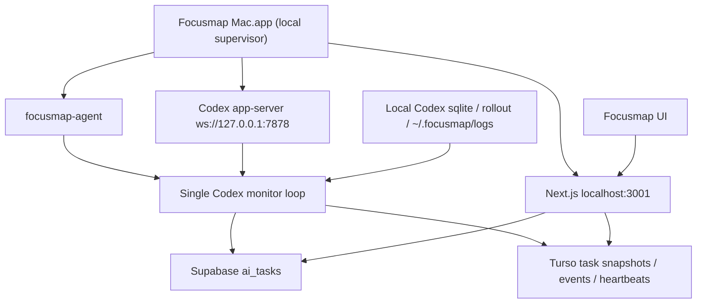

# Codex/Macローカル連携 一本化計画

- Task ID: `TASK-20260607-004`
- Status: `in_progress`
- Created: `2026-06-07`
- Board: `docs/ai/task-board.md`
- Parent chat: task-router parent chat

## 目的

Focusmap Macアプリ、`focusmap-agent`、Codex.app app-server、既存のローカル同期APIを、同じMac上で動く前提に合わせて一本化する。既存の手動ハンドオフ、Codex看板、ノード状態、activity表示は残しながら、通常時はMacアプリ起動だけで安定して高頻度な状態同期が走る構成へ移行する。

## 現状の問題

- Codex状態に触る経路が複数ある。`/api/codex/sync-node`、`scripts/task-runner.ts`、`scripts/focusmap-agent`、Electronメニュー起動がそれぞれ別の責務を持ち、同じsqlite/rollout/app-serverを観測しうる。
- UIの3秒pollが、表示のための読み取りだけでなくローカルsqlite/rollout探索やDB更新まで誘発する場合がある。複数panelを開くと同じtaskに対する確認が重なりやすい。
- 手動ハンドオフは安全だが、Codex.app側で人間が送信した後にthreadを推測する必要があり、最初のrunning反映がapp-server通知より不安定になりやすい。
- MacアプリはNext 3001の起動補助を持つが、agentとCodex app-serverはメニュー/launchd/manualに分かれていて、起動状態を一つの画面やAPIで判断しにくい。
- Codex.appやCodex CLI自体のエージェント性能は高いが、他アプリ監視やmacOS権限はFocusmap側の設計問題であり、自由に全アプリを監視できる前提にはしない。

## 目標アーキテクチャ

### 責務分担

- Macアプリ: ローカルSupervisor。Next 3001、`focusmap-agent`、Codex app-server、権限/health、ログ保存を起動時に確認する。
- `focusmap-agent`: Codex taskのclaim、app-server送信、Codex監視loop、heartbeatを担当する通常のローカル実行役。
- Codex監視loop: 同じMac上で1つだけ動くwriter。app-server通知、sqlite、rollout JSONLから状態を取り、軽量snapshot/event/activityだけを保存する。
- Next API: UIとDBの境界。短周期UI取得ではsnapshot/activityを読むだけにし、通常表示からローカルsqlite探索を起動しない。
- Supabase: `ai_tasks` のコマンド、最終状態、互換的な最新summaryの正。
- Turso: 高頻度表示用の軽量snapshot/event/heartbeatの正。
- ローカルファイル: raw sqlite、rollout、スクショ原本、実行ログの保管場所。クラウドへ全文保存しない。
- Supabase/Tursoの保存境界は `docs/specs/codex-app-handoff-monitoring/03-backyard-sync-and-turso.md` を正とする。

## 方針

- Macアプリ起動中は、Focusmap連携に必要なローカル要素も基本的に起動している状態を目指す。起動できない時は「Next」「agent」「Codex app-server」「権限」のどれが足りないかを一つのstatusで見せる。
- メモ詳細・マップノード詳細・リンクメモ詳細の標準Codex導線は `dispatch_mode='manual'` にする。Focusmapは handoff task 作成、promptコピー、Codex.app/ChatGPT Codex入口の起動、状態監視を担当し、Codex.appで最終送信するのは人間。`dispatch_mode='auto'` は明示的な自動実行導線だけで使い、通常ボタンや既存manual handoffの再操作から暗黙に昇格しない。
- Codex状態の通常writerは1つにする。`scripts/task-runner.ts` と `/api/codex/sync-node` は移行期間の互換/手動sync/debugに限定し、supervisor monitorが有効なtaskでは重複書き込みを避ける。
- UIの3秒pollは読み取り専用にする。`/api/task-progress/snapshot` と `/api/ai-tasks/[id]/activity` を読み、sqlite/rollout探索やDB writeはローカルmonitor側だけが行う。
- ローカル監視はactive task中だけ1〜5秒で確認してよいが、DB書き込みはhash/活動時刻/状態/新規activityが変わった時だけにする。heartbeatは5秒基準でよい。
- Supabaseへはtask作成、thread初回検出、状態変化、完了/失敗/確認待ち、互換fallbackだけを書く。`codex_last_checked_at` だけの無変化poll、running中の同一pulse、raw log/full thread historyはSupabaseへ書かない。Tursoが使える時、activityはTursoを主にする。
- macOS権限は機能別に明示する。全アプリ監視を暗黙に行わず、必要な時だけAccessibility、Screen Recording、Automation、Full Disk Accessを案内する。

## タスク分解

### Phase 0: 契約/計画

- `docs/CONTEXT.md` に一本化方針を反映する。
- `docs/ai/task-board.md` に本taskを登録する。
- 実装を分割できる責務境界と受け入れ条件を固定する。

### Phase 1: Mac Supervisor起動/health

- Macアプリ起動時にNext 3001を確認し、必要なら起動する。
- `focusmap-agent` を同じ起動pipelineで確認/起動する。
- Codex app-server `ws://127.0.0.1:7878` を確認し、未起動なら既存script経由で起動する。
- `/api/desktop/health` または新しいlocal status APIで、Next/agent/Codex/権限/ログパスを一括表示する。
- Macアプリ内にservice role keyを置かない。Codex実行環境から `ANTHROPIC_API_KEY` / `CLAUDECODE` を外す。

### Phase 2: Single Codex Monitor

- `focusmap-agent` 側にCodex監視loopを寄せ、app-server通知、sqlite、rolloutを一つの経路で読む。
- 同一Mac/同一user/同一taskに対するlockまたはleaseを設け、monitor loopを重複起動しない。
- `codex_thread_id` 検出、running、awaiting、needs_input、completed、failed、activity messageを軽量payloadでTurso/Supabaseへ反映する。
- active watchがあるtaskだけ会話本文をactivity化する。watchなしの巡回ではsnapshot/eventだけを書く。

### Phase 3: Dispatch Mode整理

- 標準UIはMac supervisor online/cwd/Codex app-server readyに関係なく `dispatch_mode='manual'` の手動handoffを使う。
- `dispatch_mode='auto'` は明示的な自動実行導線だけで使い、ラベルも「Macで自動実行」のように人間が違いを判断できるものにする。
- manual handoffの再コピー、Codexで開く、未送信表示は維持する。

### Phase 4: UI Polling簡素化

- `CodexNodePanel`、リンクメモ詳細、Codex看板詳細panel/drawerから、通常の3秒 `/api/codex/sync-node` 呼び出しを外す。
- UIは `/api/task-progress/snapshot` と `/api/ai-tasks/[id]/activity` を読むだけにする。
- `sync-node` は手動sync now、debug、移行中fallbackとして残す。
- 前面表示かつactive Codex taskがある時だけ3秒pollにし、バックグラウンドでは停止する。

### Phase 5: Legacy Runner整理

- `scripts/task-runner.ts` は非Codex taskや既存互換のため一旦残す。
- supervisor monitorが有効な時は、`task-runner.ts` のCodex sqlite/rollout監視を無効化または対象外にする。
- parity確認後、Codex監視責務を`focusmap-agent`へ完全移管する。

### Phase 6: 権限/onboarding

- Mac statusに必要権限を表示する。
- 最初から全権限を要求せず、機能に応じて案内する。
- Full Disk Access: Codex sqlite/rollout読み取りが必要な時。
- Accessibility/Automation: Codex.appやTerminalを操作する導線が必要な時。
- Screen Recording: スクショpreviewや画面監視が必要な時。

### Phase 7: 検証/移行

- ローカル `npm run mac:dev` で3001、agent、Codex app-serverの起動状態を確認する。
- manual handoff taskを作り、通常ボタンでは `needs_input` / `prompt_waiting` になり、Codex.appへの `turn/start` が自動送信されないことを確認する。
- 明示的なauto taskを作る場合だけ、初回runningが5秒以内にUIへ出ることを確認する。
- 複数panelを開いても同一taskに重複snapshot/eventが増えないことを確認する。
- 3秒UI pollがDB writeを増やさないことを確認する。

## 受け入れ条件

- Macアプリを開くと、Next 3001、agent、Codex app-serverが起動済みまたは起動不能理由つきで確認できる。
- Mac上で開始したCodex taskは、通常経路で5秒以内に `未送信` から `実行中` または `確認待ち` へ進む。
- 同じCodex taskのsnapshot/event writerは1つだけになる。
- UIの3秒pollは読み取り専用で、表示中という理由だけでsqlite/rollout探索やDB writeを発生させない。
- manual handoff、prompt再コピー、未送信/実行中/確認待ち/接続失敗/完了の表示は維持される。
- raw log/full thread historyはクラウドへ保存しない。

## 並列化判断

Decision: `HYBRID_PLAN_THEN_PARALLEL`

まず親chatで契約とtaskを固定する。その後の実装は、共有契約が固まってから以下へ分割できる。

- Mac/Electron worker: `desktop/focusmap-mac/**`、Mac supervisor、status表示、起動ログ。
- Agent/monitor worker: `scripts/focusmap-agent/**`、Codex app-server/sqlite/rollout監視、lease、payload生成。
- API/DB worker: `src/app/api/task-progress/**`、Codex sync APIのfallback化、Turso/Supabase write境界。
- UI worker: Codex panel、看板、mindmap hookのpolling整理。
- Legacy runner worker: `scripts/task-runner.ts` のCodex監視停止条件と互換範囲整理。
- Integration worker: `docs/CONTEXT.md`、task board、run log、最終検証を一元管理する。

## 検証コマンド候補

- `npm run lint -- <touched files>`
- `npm run test:run -- src/lib/codex-run-state.test.ts`
- `npm run mac:dev`
- `curl http://127.0.0.1:3001/api/desktop/health`
- `git diff --check`

## Progress

- 2026-06-07: Phase 1の設定UI入り口として、Focusmap MacアプリのElectron IPCに `getAutomationStatus` / `connectAutomation` / `disconnectAutomation` を追加し、設定 > 自動化の先頭へ `Mac / Codex Connection` カードを追加した。カードはNext 3001、Macアプリ管理下の `focusmap-agent`、Codex app-serverを5秒ごとに診断し、Macアプリ内だけで接続/切断できる。通常ブラウザ、Cloud Run、スマホからローカルMacを制御するAPIは追加していない。

## リスク

- Codex app-serverやsqlite/rolloutはCodex側の内部仕様変更を受ける可能性がある。Focusmapが開始したturnはapp-server通知を優先し、sqlite/rolloutは補助観測にする。
- macOS権限が不足すると監視/操作できない範囲が出る。権限不足は失敗扱いではなくstatusとして表示し、manual handoffへfallbackする。
- 移行中に複数writerが残ると、古いsnapshotが新しい状態を上書きする。task単位のleaseとwriter metadataを先に入れる。
- UIから`sync-node`を急に外すとmanual handoff検出が遅れる可能性がある。Phase 4ではdebug/manual fallbackとして残し、auto経路のparityを先に確認する。
