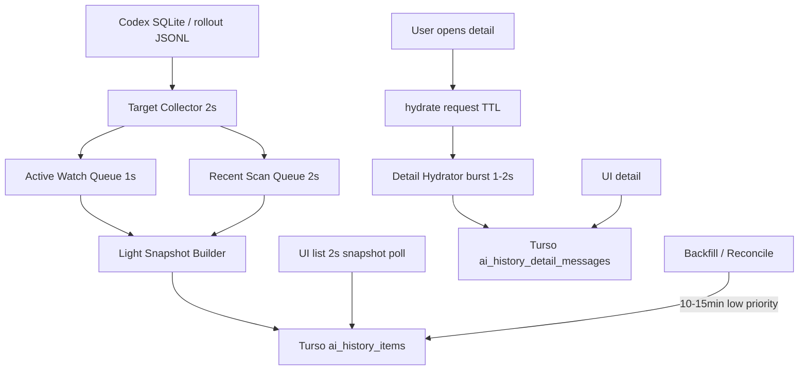
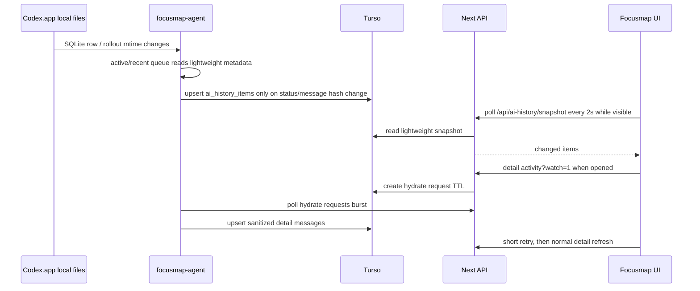

# AI History Monitor Stability Handoff

- Task ID: TASK-20260624-002
- Status: planned
- Created: 2026-06-24
- Completed:
- Board: `docs/ai/task-board.md`

## Goal

AI履歴取り込みとCodex再開検知を、実運用で詰まらず安定して3秒以内にUIへ反映できる構造へ直す。

成功条件:

- activeなCodex threadの新規prompt / resume / running復帰は、Codex側イベント発生からFocusmap UI表示まで原則3秒以内。
- 監視agentのhot pathは、通常時 `tick duration p95 < 500ms`、overrun/skipped tickをheartbeatで観測できる。
- recent threads と active targets は2秒級で確認しても、reconcile/backfill/detail hydrateに引きずられて詰まらない。
- Tursoへ常時流すのは軽量snapshotだけにし、詳細本文はユーザーが開いた時だけhydrateする。
- DBへ作業時間を毎秒writeしない。running中の秒表示はUIローカルtimerで補完する。
- 仕様変更が完了したら `docs/CONTEXT.md` にCodex監視・AI履歴・Turso/UI反映タイミングの正本を更新する。

## Non-goals

- Codex.appの内部APIへ未確認の直接依存を増やさない。
- raw rollout全文、command output、screenshot/base64をTursoへ常時保存しない。
- 本番DBやTursoの破壊的操作をしない。
- AI履歴UIの見た目全面リデザインはしない。
- `task-runner` 退役やMac installer全体の再設計はこのタスクに混ぜない。
- push / deploy はユーザー明示なしに行わない。

## Current Findings

調査時点の主な事実:

- agent CLIの実行時既定は Codex monitor 1s、target refresh 3s、reconcile 60s。`startCodexThreadMonitorLoop` 自体のreconcile defaultは1hだが、CLIが60sで上書きしている。
- 1秒tickの中に、target取得、pre-import task同期、detail hydrate、AI履歴hot sync、reconcile/backfill、post-syncが同居している。
- tick中は `running` guardで次tickが無言skipされるため、詰まりがUI上の25-30秒遅延として見えやすい。
- active watchは「project上位20件だけ」ではない。recent top 20 / scope別top 20 / Turso active targets最大100件 / detail watch request が同じhot sync通路へ合流する。
- SQLite読み取りは外部 `sqlite3` spawnで、hot path内で回数が増える。
- rollout JSONLはraw cacheがあるが、summary parseは毎回全量。
- running durationはDBへ毎秒writeする必要はない。現UIは `workDurationSeconds + now - indexedAt` で1秒表示を補完している。
- 既に `/api/ai-history/snapshot` は存在するが、通常の `useAiHistory` は3秒ごとに `/api/ai-history` の一覧を取り直している。

## Terminology

この計画で混同しやすい名前を先に分ける。

| 名前 | これは何か | 重さへの関係 | 今回の扱い |
|---|---|---|---|
| `task-router` | Codex作業を分解し、計画・worker prompt・進捗記録を作るための運用Skill / docs workflow | 常駐監視ではない。アプリのCPUやAI履歴遅延の原因ではない | なくさない。今回も計画・引き継ぎのために使う |
| `scripts/task-runner.ts` | 旧ローカルrunner。過去のCodex監視・task実行互換経路を持つruntime | 通常運用からは退役済み。`focusmap-agent` と二重writerになると重い/危険 | 今回の主作業には混ぜない。ファイル自体はlegacy/debug互換として残るが、通常Codex監視はOFFの前提 |
| `focusmap-agent` | 現在のMacローカル実行・Codex監視・heartbeatの本命runtime | 今回の詰まり解消の主対象 | hot pathを軽くし、重い処理を分離する |

## Monitoring Inventory

「何を監視しているか」と「今回の計画に入れるか」を明確にする。

### In This Plan

| 監視/処理 | 何を見ているか | 何のためか | 現状の問題 | 今回の扱い |
|---|---|---|---|---|
| Active Watch | selected / running / awaiting_approval / needs_input / resume直後のCodex thread | ユーザーが今見ている・今動いているAI履歴を3秒以内に反映する | recent/reconcile/detail hydrateと同じ通路で詰まりやすい | 高頻度に残す。1秒基準。ただし対象を絞る |
| Recent Scan | Codex SQLiteの全体最新20件と、監視中project/repo/worktree scopeごとの最新20件 | 新規Codex promptや最近の再開を拾う | detail本文やreconcileと混ざると重い | 2秒基準で軽量metadataだけ見る |
| Target Refresh | agent対象task、import scope、active AI履歴target、detail watch request | どのthreadを高頻度監視するか決める | 取得後に全targetを重く処理すると詰まる | 2秒基準で対象リストだけ更新する |
| AI履歴 Reconcile / Backfill | 過去の取りこぼし、古いscope、top20外の履歴 | 見逃し修復 | 60秒ごとに1秒tick内で走ると重い | 高頻度から外す。10-15分 or manual / low priority |
| Detail Hydrate | 選択されたAI履歴の本文・表示用message | 詳細を開いた時に本文を表示する | 常時寄りにpollするとrollout parseとTurso writeが増える | 開いた時だけ短期burst。その後3-5秒へ戻す |
| Snapshot Poll | `/api/ai-history/snapshot` の軽量差分 | UI一覧の状態更新 | 既存のfull list pollだとcounts/list全取得になりがち | 2秒基準でitemsだけmerge。countsは毎回取らない |
| Work Duration Display | `workDurationSeconds + now - indexedAt` | 実行中の作業秒数表示 | DBへ毎秒writeするとTurso writeが増える | DB毎秒writeは禁止。UIローカルtimerで補完 |
| Codex DB Path Check | `~/.codex/state_5.sqlite` / `~/.codex/sqlite/state_5.sqlite` のどちらが新しいか | 正しいCodex state DBを読む | 毎tick freshness queryするとsqlite spawnが増える | TTL cache。毎秒重く確認しない |
| Rollout Summary Parse | rollout JSONLの `user_message` / `task_started` / `task_complete` / reasoning/tool activity | running/resume/awaiting判定 | raw cacheだけでは毎回全量parseになる | fingerprint summary cacheを入れる |
| Tick Health Metrics | tick duration / skipped tick / phase timing / queue length | 詰まり箇所を観測する | 現状は遅延してもどのphaseが詰まったか見えにくい | heartbeat metadataへ追加する |

### Not In This Plan

| 監視/処理 | 何を見ているか | なぜ今回に入れないか | 後でやるなら |
|---|---|---|---|
| `scripts/task-runner.ts` の物理削除 / legacy責務完全撤去 | staff-status、Claude/package、旧互換実行など、まだファイル内に残るlegacy/debug責務 | 通常運用からの退役は済み。今回に物理削除まで混ぜるとAgent hot path修正がぼやける | legacy/debugも不要と判断できた段階で別タスク化する |
| 旧 `task-runner` Codex監視 | 旧runnerがCodex SQLite/rolloutを見るdebug互換経路 | 通常Codex監視からは既に除外済み。今回の実装対象は `focusmap-agent` | Integrationで `FOCUSMAP_LEGACY_CODEX_MONITOR=1` なしに通常起動しないことを再確認 |
| Runner Heartbeat UI Poll | `/api/task-progress/runner-heartbeats` でMac agent online/offlineを見る | AI履歴resume遅延の本丸ではない。online表示のUXタスク | 設定画面/前面表示時だけ短周期、それ以外30秒以上へ整理 |
| `useAiTasks` / `useNoteAiTasks` / `useMemoAiTasks` のpoll整理 | 各画面のAI task一覧・linked task状態 | AI履歴snapshot化と別のUI全体poll整理。先にagent詰まりを直す | 共通snapshot hookへ寄せる別タスク |
| Repo Availability / Scan | ローカルrepo候補、worktree、scan結果 | repo候補は秒単位で変わらない。AI履歴3秒反映とは別 | agent heartbeat正本 + 5分cache / 手動更新へ寄せる |
| Desktop Supervisor Process Watch | Focusmap Mac appがagent/Codex app-serverを起動・復旧する監視 | Macプロセス管理でありAI履歴hot pathではない | Mac app安定化タスクでinterval/復旧条件を確認 |
| Memo/Wishlist Codex Activity Poll | メモ・願望詳細で関連Codex activityを10秒程度で読む | 個別画面の表示補助。今回のAI履歴一覧/詳細の詰まりとは別 | AI履歴snapshot安定後、表示中だけに限定する |
| Calendar / Mindmap Realtime Poll | カレンダー、マップ、task-progressの通常UI同期 | 別機能のUX同期。今回混ぜると検証範囲が広すぎる | 画面別に「前面だけ」「activeだけ」へ整理 |

## Target Architecture

重い処理を1秒監視から外し、用途ごとにループを分ける。



### Loop Ownership

| Loop | Target interval | Responsibility | Must not do |
|---|---:|---|---|
| Active Watch | 1s | selected/running/awaiting/needs_input/recent resume thread only | global scan, reconcile, all detail hydrate |
| Recent Scan | 2s | global recent top 20 + enabled scope recent top 20 metadata | detail message sync |
| Target Refresh | 2s | tasks/import scopes/active targets/watch requests refresh | rollout full parse for all targets |
| Detail Hydrate | idle 5s, burst 1-2s after request | selected detail messages only | list metadata sync |
| Reconcile / Backfill | 10-15min or manual | missed old items, scope backfill | active watch tick |

### Data Flow



## Parallelization Decision

`HYBRID_PLAN_THEN_PARALLEL`

理由:

- `scripts/focusmap-agent/src/codex-thread-monitor.ts` は中心ファイルなので、agent hot-path修正を複数workerへ同時に分けると衝突しやすい。
- Backend/APIとFrontendは、snapshot/hydrate contractが安定すれば編集範囲を分けられる。
- Integrationは必須。source codeだけ直しても、Macアプリ同梱agentやheartbeat観測が古いままだと再発する。

推奨フロー:

1. Phase 1: Agent Hot Path workerを直列で実装する。
2. Phase 2: Agent workerのcommit後、Backend/API workerとFrontend workerを並列で進める。
3. Phase 3: Integration/Evaluation chatが全commitをレビュー、統合、検証、docs更新、必要ならMac app再インストール確認を行う。

代替案:

- 全部単一チャット: 衝突は少ないが、範囲が広くレビューが甘くなりやすい。
- 最初からAgent/API/UI並列: Agent contractが未固定なので危険。
- UIだけ先行: 表示pollを短くしてもagentが詰まれば解決しない。

## Worktree Plan

大きい実装なので、実装workerは原則別Codexチャット + 別worktreeでよい。親/評価チャットは実装しない。

Base:

- `origin/main` または最新local `main`
- 作業開始時に各workerは `git fetch --prune origin`、`git status --short --branch`、`git worktree list` を確認する。

Recommended branches:

| Role | Branch | Worktree | Merge order |
|---|---|---|---:|
| Agent Hot Path | `codex/ai-history-monitor-agent-hotpath` | `focusmap-ai-history-monitor-agent-hotpath` | 1 |
| Backend/API | `codex/ai-history-monitor-api-snapshot` | `focusmap-ai-history-monitor-api-snapshot` | 2 |
| Frontend/UI | `codex/ai-history-monitor-ui-snapshot` | `focusmap-ai-history-monitor-ui-snapshot` | 3 |
| Integration | use existing clean `main` worktree or temporary integration branch if needed | `focusmap-codex-reconcile-main` | final |

Lifecycle:

- Worker commits are intermediate. 完了はlocal mainへ統合されてから。
- Workers do not push.
- Workers do not edit `docs/ai/task-board.md`, `docs/ai/task-runs.jsonl`, `docs/ai/mistakes.md`, `docs/ai/task-router-analysis.md`, or archives.
- Integration updates `docs/CONTEXT.md`, this plan, task-board, task-runs, and archive after all implementation is accepted.

## Implementation Plan

## Worker Return Log

### 2026-06-24 Agent Hot Path worker

Returned commit:

- Branch/worktree: `feat/ai-history-fast-watch-agent` / `/Users/kitamuranaohiro/Private/focusmap-ai-history-fast-watch-agent`
- Commit: `0850990a focusmap-agent: AI履歴監視hot pathを分離`
- Changed files in the worker commit:
  - `scripts/focusmap-agent/src/codex-thread-monitor.ts`
  - `scripts/focusmap-agent/src/cli.ts`
  - `scripts/focusmap-agent/codex-thread-monitor.test.ts`
- Worker-reported verification:
  - `npm run test:run -- scripts/focusmap-agent/codex-thread-monitor.test.ts --test-timeout=30000`: passed, 39 tests
  - `npm --prefix scripts/focusmap-agent run build`: passed
  - `npx eslint ...`: passed with no warnings
  - `git diff --check`: passed

Integration warning:

- Do not merge the whole `feat/ai-history-fast-watch-agent` branch into current `main`.
- The branch diverges from an old AI history base (`aaa9ac0136c9d6aaa03fba289d709dcbe96e16be`), and `main..feat/ai-history-fast-watch-agent` includes broad unrelated deletions/rollbacks.
- Integration must bring over only the worker commit intent from `0850990a`, preferably by cherry-picking onto latest local `main` and resolving conflicts, or by manually reapplying the three-file patch.
- After applying, verify that no unrelated docs/UI/API/mobile/task-runner rollback is present.

### Phase 1: Agent Hot Path Unclogging

Objective:

- 1秒monitor tickからreconcile/backfill/detail-heavy workを外し、overrunを見える化する。

Required changes:

1. Change CLI reconcile default from 60s to a safe low-frequency value, ideally 10-15min or the monitor default 1h.
2. Split hot tick into bounded phases with time budget:
   - target refresh
   - active watch
   - recent scan
   - detail hydrate request poll
   - reconcile queue
3. Add heartbeat metrics:
   - `codex_last_tick_duration_ms`
   - `codex_skipped_ticks`
   - `codex_tick_overrun_ms`
   - `codex_phase_timings_ms`
   - `codex_active_watch_count`
   - `codex_recent_scan_count`
   - `codex_reconcile_queue_length`
4. Add DB path cache with short TTL. Do not run freshness sqlite query every 1s if known path is valid.
5. Add batch read for active target thread ids, or at minimum tick-local row cache so missing active target rows do not spawn one sqlite process per id.
6. Add rollout summary cache keyed by `threadId + rolloutPath + mtimeMs + size + updated_at_ms`.
7. Ensure reconcile/backfill never runs inside the 1s active watch tick. If implemented in the same module, schedule it independently and skip it when hot loop is over budget.
8. Preserve existing status semantics:
   - `user_message` after checkpoint means running.
   - `task_complete` means awaiting approval.
   - stale/no terminal event stays check-needed, not completed.

Acceptance:

- active watch can run even when reconcile is due.
- skipped tick count is observable.
- recent thread detection does not depend on reconcile.
- tests cover at least:
  - reconcile interval default / separation
  - active targets read without per-id serial explosion where practical
  - rollout summary cache reuse
  - resume detection remains based on post-complete user prompt

### Phase 2A: Backend/API Snapshot and Watch Contract

Objective:

- UIが軽量snapshotを2秒で読めるよう、既存 `/api/ai-history/snapshot` とhydrate requestの契約を安定化する。

Required changes:

1. Review `/api/ai-history/snapshot` response and confirm it has all fields needed for list update:
   - id
   - externalThreadId
   - status
   - runState
   - title/snippet
   - lastActivityAt
   - indexedAt
   - startedAt/endedAt/workDurationSeconds
   - detail hydrate state
2. If needed, add lightweight sync metadata:
   - `serverTime`
   - `cursor`
   - `changedSince`
   - maybe `agentSeenAt` or `monitorObservedAt` only if already available without heavy writes.
3. Keep active monitor targets as lightweight Turso read. Do not add a new heavy query.
4. Detail hydrate request should support burst-friendly use:
   - `watch=1` creates/refreshes TTL.
   - repeated calls are idempotent.
   - linked `ai_task` detail redirect remains compatible.
5. Avoid per-request expensive reconcile in list/snapshot APIs.

Acceptance:

- UI can use snapshot for incremental list refresh without fetching counts every 2s.
- Detail hydrate remains on-demand.
- No raw Codex rollout/full transcript is exposed.

### Phase 2B: Frontend 2s Snapshot Poll and Detail Burst

Objective:

- UIは軽いsnapshotを2秒で取り、詳細本文は開いた時だけ短期burstで取得する。

Required changes:

1. Extend `useAiHistory` or add a companion hook to:
   - initial load: `/api/ai-history` for full list/counts
   - visible active refresh: `/api/ai-history/snapshot` every 2s
   - merge changed items by id/externalThreadId
2. Do not refresh counts/buckets every 2s. Counts can stay initial/periodic slower refresh.
3. Preserve repo display filtering and current sidebar behavior.
4. Running/resume visibility:
   - UI poll 2s while sidebar/dashboard visible.
   - resume running display should not disappear before one UI poll can see it. Prefer 5-6s visibility if agent keeps `RESUME_RUNNING_VISIBILITY_MS` short.
5. Detail hydrate:
   - first 10s after opening selected detail: 1s retry or 1s/2s/3s backoff.
   - after hydrated or timeout: return to 3-5s.
6. Work duration:
   - Keep local 1s timer.
   - Do not require DB every-second duration writes.

Acceptance:

- A new/running/resumed card can update from snapshot without full list reload.
- Cold detail shows placeholder/fallback immediately, then hydrates without blocking list.
- No direct agent API call from browser.

### Phase 3: Integration / Evaluation

Objective:

- 全worker commitをレビューし、local mainへ統合して、実機で詰まりが解消したか確認する。

Required checks:

1. Review worker reports and commits against allowed files.
2. Search for remaining hot-path heavy work:
   - `reconcile`
   - `sqliteJson`
   - `readThread`
   - `parseRollout`
   - `setInterval`
3. Confirm heartbeat exposes tick duration and skipped ticks.
4. Confirm UI list fast path uses snapshot/incremental update and detail hydrate remains on-demand.
5. Confirm `docs/CONTEXT.md` records the new sync/dataflow rules.
6. Build/install Mac app only when explicitly allowed by the prompt/user, then verify bundled agent version if changed.

Suggested verification commands for Integration:

- `npm run test:run -- scripts/focusmap-agent/codex-thread-monitor.test.ts src/hooks/useAiHistory.test.ts src/components/dashboard/codex-chat-import-sidebar.test.tsx src/app/api/ai-history/snapshot/route.test.ts 'src/app/api/ai-history/[id]/activity/route.test.ts' src/app/api/agents/ai-history/active-monitor-targets/route.test.ts --test-timeout=30000`
- `npm --prefix scripts/focusmap-agent run build`
- `npx eslint scripts/focusmap-agent/src/codex-thread-monitor.ts scripts/focusmap-agent/src/api-client.ts src/hooks/useAiHistory.ts src/components/dashboard/codex-chat-import-sidebar.tsx src/app/api/ai-history/snapshot/route.ts 'src/app/api/ai-history/[id]/activity/route.ts' src/app/api/agents/ai-history/active-monitor-targets/route.ts`
- `git diff --check`

Manual/runtime checks, only when explicitly requested:

- Start/confirm Focusmap dev server on `http://localhost:3001` only.
- Confirm Mac bundled agent process and heartbeat metadata.
- Resume an awaiting Codex thread and measure:
  - Codex rollout event time
  - agent observed time
  - Turso indexed time
  - UI render time

## Parent / Evaluation Role

This chat should act as evaluator, not implementation worker.

Responsibilities:

- Keep this plan as the contract.
- Review returned worker reports and commits.
- Reject scope creep, especially UI-only polling changes that do not unclog agent hot path.
- Require Integration to prove source and installed/bundled agent are not diverging if Mac app is rebuilt.
- Confirm final state is local main integrated before calling the task complete.

## Worker Prompt: Agent Hot Path

```md
あなたは Agent Hot Path 実装チャットです。

目的:
AI履歴/Codex再開監視の詰まりを解消する。1秒active watchをreconcile/detail/backfillから分離し、2秒recent/active target確認でも詰まらないfocusmap-agentにする。

まず読む:
- AGENTS.md
- docs/CONTEXT.md
- docs/ai/plans/active/20260624-ai-history-monitor-stability-handoff.md
- scripts/focusmap-agent/src/codex-thread-monitor.ts
- scripts/focusmap-agent/src/cli.ts
- scripts/focusmap-agent/codex-thread-monitor.test.ts

編集してよい範囲:
- scripts/focusmap-agent/src/codex-thread-monitor.ts
- scripts/focusmap-agent/src/cli.ts
- scripts/focusmap-agent/src/api-client.ts（必要な場合のみ）
- scripts/focusmap-agent/src/types.ts（heartbeat metadata型が必要な場合のみ）
- scripts/focusmap-agent/codex-thread-monitor.test.ts

編集してはいけない範囲:
- src/components/**
- src/hooks/**
- src/app/api/**（Agent API client変更に必要な型だけでは足りない場合はIntegrationへ相談）
- db/**
- docs/ai/task-board.md
- docs/ai/task-runs.jsonl
- docs/ai/mistakes.md
- docs/ai/task-router-analysis.md
- docs/ai/task-archive/**
- docs/ai/plans/archive/**
- package-lock.json
- secrets / .env*

実装要件:
1. CLIのreconcile既定60秒をやめ、hot monitorと低頻度reconcileを分離する。
2. active watch / recent scan / detail hydrate / reconcileの処理境界を明確にする。
3. tick overrun/skipped tick/phase timingをheartbeat metadataへ出す。
4. DB path freshness checkを毎秒重くしない。
5. active target missing rowsのreadThread連発を避ける。batch readまたはtick-local cacheを使う。
6. rollout summary parseをfingerprint cacheする。
7. resume/running/awaiting/staleの既存意味を変えない。
8. running durationは毎秒Turso writeしない方針を維持する。

検証コマンド:
- npm run test:run -- scripts/focusmap-agent/codex-thread-monitor.test.ts --test-timeout=30000
- npm --prefix scripts/focusmap-agent run build
- npx eslint scripts/focusmap-agent/src/codex-thread-monitor.ts scripts/focusmap-agent/src/cli.ts scripts/focusmap-agent/src/api-client.ts scripts/focusmap-agent/src/types.ts scripts/focusmap-agent/codex-thread-monitor.test.ts
- git diff --check

完了条件:
- active watchがreconcile待ちで詰まらない。
- overrun/skipped tickが観測可能。
- tests/build/lint結果を報告している。
- 自分のallowed filesだけcommitしている。
- pushしていない。

最後に返すこと:
- 完了
- changed files
- implemented behavior
- test commands and results
- tick/phase metric fields
- assumptions
- contract deviations
- integration notes
- risks / unresolved items
- staged / unstaged changes
- commit hash
```

## Worker Prompt: Backend/API Snapshot Contract

```md
あなたは Backend/API 実装チャットです。

目的:
AI履歴UIが2秒で軽量snapshotを取得できるAPI契約を安定化し、detail hydrateはオンデマンドのまま保つ。

まず読む:
- AGENTS.md
- docs/CONTEXT.md
- docs/ai/plans/active/20260624-ai-history-monitor-stability-handoff.md
- src/app/api/ai-history/route.ts
- src/app/api/ai-history/snapshot/route.ts
- src/app/api/ai-history/[id]/activity/route.ts
- src/app/api/agents/ai-history/active-monitor-targets/route.ts
- src/lib/turso/ai-history.ts
- src/types/ai-history.ts

編集してよい範囲:
- src/app/api/ai-history/snapshot/route.ts
- src/app/api/ai-history/[id]/activity/route.ts
- src/app/api/agents/ai-history/active-monitor-targets/route.ts
- src/lib/turso/ai-history.ts
- src/types/ai-history.ts
- related route/lib tests

編集してはいけない範囲:
- scripts/focusmap-agent/**
- src/components/**
- src/hooks/**（型importの必要があってもFrontend workerへ相談）
- db/**（migrationが必要なら先にIntegrationへ報告）
- docs/ai/task-board.md
- docs/ai/task-runs.jsonl
- docs/ai/mistakes.md
- docs/ai/task-router-analysis.md
- docs/ai/task-archive/**
- package-lock.json
- secrets / .env*

実装要件:
1. `/api/ai-history/snapshot` がUIのincremental 2秒pollに必要な軽量項目を返すことを確認/補強する。
2. snapshotではcounts/reconcile/重い一覧整合を走らせない。
3. `watch=1` detail requestはTTL refreshとして冪等に扱う。
4. linked ai_task detail redirect互換を壊さない。
5. active monitor targetsは軽量Turso readのまま維持する。
6. raw rollout/full transcript/command outputをAPIで出さない。

検証コマンド:
- npm run test:run -- src/app/api/ai-history/snapshot/route.test.ts 'src/app/api/ai-history/[id]/activity/route.test.ts' src/app/api/agents/ai-history/active-monitor-targets/route.test.ts src/lib/turso/ai-history.test.ts --test-timeout=30000
- npx eslint src/app/api/ai-history/snapshot/route.ts 'src/app/api/ai-history/[id]/activity/route.ts' src/app/api/agents/ai-history/active-monitor-targets/route.ts src/lib/turso/ai-history.ts src/types/ai-history.ts
- git diff --check

完了条件:
- Frontend workerがsnapshotだけでlist updateできる契約が明確。
- detail hydrateはオンデマンド。
- 自分のallowed filesだけcommitしている。
- pushしていない。

最後に返すこと:
- 完了
- changed files
- API response fields
- test commands and results
- assumptions
- contract deviations
- integration notes
- risks / unresolved items
- staged / unstaged changes
- commit hash
```

## Worker Prompt: Frontend/UI Snapshot and Detail Burst

```md
あなたは Frontend/UI 実装チャットです。

目的:
AI履歴一覧を軽いsnapshotで2秒更新し、detail本文は開いた時だけ短期burstでhydrateする。agentの詰まりをUI poll増加で隠さない。

まず読む:
- AGENTS.md
- docs/CONTEXT.md
- docs/ai/plans/active/20260624-ai-history-monitor-stability-handoff.md
- src/hooks/useAiHistory.ts
- src/hooks/useAiHistory.test.ts
- src/components/dashboard/codex-chat-import-sidebar.tsx
- src/components/dashboard/codex-chat-import-sidebar.test.tsx
- src/types/ai-history.ts

編集してよい範囲:
- src/hooks/useAiHistory.ts
- src/hooks/useAiHistory.test.ts
- src/components/dashboard/codex-chat-import-sidebar.tsx
- src/components/dashboard/codex-chat-import-sidebar.test.tsx
- src/types/ai-history.ts（Backend/API workerの契約に合わせる必要がある場合のみ）

編集してはいけない範囲:
- scripts/focusmap-agent/**
- src/app/api/**
- src/lib/turso/**
- db/**
- docs/ai/task-board.md
- docs/ai/task-runs.jsonl
- docs/ai/mistakes.md
- docs/ai/task-router-analysis.md
- docs/ai/task-archive/**
- package-lock.json

実装要件:
1. 初回/大きなフィルタ変更は既存 `/api/ai-history` で一覧とcountsを取る。
2. 表示中の短周期更新は `/api/ai-history/snapshot` を2秒で使い、itemsだけmergeする。
3. counts/bucketsを2秒ごとに取り直さない。
4. running/resume状態は最低1回の2秒pollで見えるようにする。必要ならUI側保持を5-6秒にする。
5. selected detailのhydrate待ちは最初10秒だけ1秒retryまたは短いbackoff、その後3-5秒へ戻す。
6. work durationは既存ローカル1秒timerで表示し、DB毎秒writeを要求しない。
7. API未実装fieldを勝手に前提にしない。契約ズレはIntegrationへ報告する。

検証コマンド:
- npm run test:run -- src/hooks/useAiHistory.test.ts src/components/dashboard/codex-chat-import-sidebar.test.tsx --test-timeout=30000
- npx eslint src/hooks/useAiHistory.ts src/hooks/useAiHistory.test.ts src/components/dashboard/codex-chat-import-sidebar.tsx src/components/dashboard/codex-chat-import-sidebar.test.tsx
- git diff --check

完了条件:
- snapshot mergeでlist itemが更新される。
- detail hydrateは選択中だけburstする。
- 自分のallowed filesだけcommitしている。
- pushしていない。

最後に返すこと:
- 完了
- changed files
- implemented UI behavior
- test commands and results
- assumptions
- API contract deviations
- integration notes
- risks / unresolved items
- staged / unstaged changes
- commit hash
```

## Worker Prompt: Integration / Evaluation

```md
あなたは Integration / Evaluation チャットです。実装そのものより評価・統合・仕上げが役割です。

目的:
Agent Hot Path、Backend/API、Frontend/UI workerの成果をレビューし、詰まらないAI履歴監視としてlocal mainへ統合する。

まず読む:
- AGENTS.md
- docs/CONTEXT.md
- docs/ai/plans/active/20260624-ai-history-monitor-stability-handoff.md
- 各workerの完了報告とcommit hash

やること:
1. git status / worktree listを確認する。
2. 各worker commitがallowed filesだけ触っているか確認する。
3. Agent workerのhot pathからreconcile/detail-heavy workが外れているか読む。
4. Backend/API contractとFrontend実装が一致しているか読む。
5. `rg`で `reconcile`, `sqliteJson`, `readThread`, `parseRollout`, `setInterval`, `AI_HISTORY_DETAIL_HYDRATE_POLL` を確認し、重い処理が1秒tickへ戻っていないか見る。
6. 必要な最小統合修正を行う。
7. `docs/CONTEXT.md` へ新しいCodex監視/AI履歴/Turso/UI反映タイミングを記録する。
8. `docs/ai/task-board.md`, `docs/ai/task-runs.jsonl`, このplan、必要ならarchiveを更新する。
9. 明示許可がある場合だけMac app build/installやlocalhost/Arc/Browser確認を行う。

編集してよい範囲:
- 統合に必要な最小範囲
- docs/CONTEXT.md
- docs/ai/task-board.md
- docs/ai/task-runs.jsonl
- docs/ai/task-archive/2026/06.md
- docs/ai/plans/archive/2026/06/**（完了時）

編集してはいけない範囲:
- unrelated refactor
- reset --hard / clean -fd / force push
- secrets / .env*
- 本番DB操作
- worker scopeの不要な全面書き換え

検証コマンド:
- npm run test:run -- scripts/focusmap-agent/codex-thread-monitor.test.ts src/hooks/useAiHistory.test.ts src/components/dashboard/codex-chat-import-sidebar.test.tsx src/app/api/ai-history/snapshot/route.test.ts 'src/app/api/ai-history/[id]/activity/route.test.ts' src/app/api/agents/ai-history/active-monitor-targets/route.test.ts --test-timeout=30000
- npm --prefix scripts/focusmap-agent run build
- npx eslint scripts/focusmap-agent/src/codex-thread-monitor.ts scripts/focusmap-agent/src/cli.ts src/hooks/useAiHistory.ts src/components/dashboard/codex-chat-import-sidebar.tsx src/app/api/ai-history/snapshot/route.ts 'src/app/api/ai-history/[id]/activity/route.ts' src/app/api/agents/ai-history/active-monitor-targets/route.ts
- git diff --check

完了条件:
- local mainに全成果が統合されている。
- active watch / recent scan / reconcile / detail hydrateの責務が分離している。
- UI listは軽量snapshot、detailはon-demand hydrate。
- heartbeatでtick詰まりが観測できる。
- docs/CONTEXT.mdが正本として更新されている。
- push/deployしていない。

最後に返すこと:
- merged branches / commits
- changed files
- integration fixes
- test commands and results
- runtime/manual checks performed or not performed
- unresolved risks
- local main / origin main / production reflection status
- task-board / task-runs / archive update status
- final commit hash
```

## Review Checklist For This Chat

実装が戻ってきたら、このチャットは最低限以下を確認する。

- Agent:
  - 1秒tickでreconcileが走らない。
  - sqlite spawn回数が増えていない。
  - rollout parse cacheがfingerprintで効く。
  - active target最大100件を無制限serial処理しない。
  - `user_message` resume判定が維持されている。
- Backend/API:
  - snapshot routeがcounts/reconcileを含まない軽い取得。
  - hydrate requestはidempotent。
  - linked ai_task redirect互換あり。
- Frontend:
  - 2秒pollはsnapshotだけ。
  - detail hydrate burstは選択中だけ。
  - work durationはlocal timer補完。
- Docs:
  - `docs/CONTEXT.md` に新しい正本がある。
  - task-boardの状態とworker branch lifecycleが一致。

## Run Record Draft

Integration完了時は `docs/ai/task-runs.jsonl` に以下の形で実績を残す。

```json
{
  "run_id": "20260624-ai-history-monitor-stability-integration",
  "task_id": "TASK-20260624-002",
  "mode": "HYBRID_PLAN_THEN_PARALLEL",
  "implementation_channel": "codex_chat_worktree",
  "implementation_chats": ["Agent Hot Path", "Backend/API Snapshot", "Frontend/UI Snapshot", "Integration/Evaluation"],
  "parallel_decision": "HYBRID_PLAN_THEN_PARALLEL",
  "decision_reason": "Agent hot pathは同一ファイル衝突リスクが高く直列、Backend/APIとFrontendは契約確定後に並列可能",
  "readonly_subagents": [],
  "disjoint_write_scopes": false,
  "contract_first": true,
  "parallel_risk": "medium"
}
```

## Status Board

```text
[router 状態] 目的: AI履歴監視の詰まり解消
 詰め: 完了  分解: 4タスク  実装: 未
 #1 Agent Hot Path      直列最優先  未
 #2 Backend/API         Phase1後に並列可  未
 #3 Frontend/UI         Phase1後に並列可  未
 #4 Integration/Review  最終評価  未
 検証: 未   main統合: 未   push/deploy: 未
```
