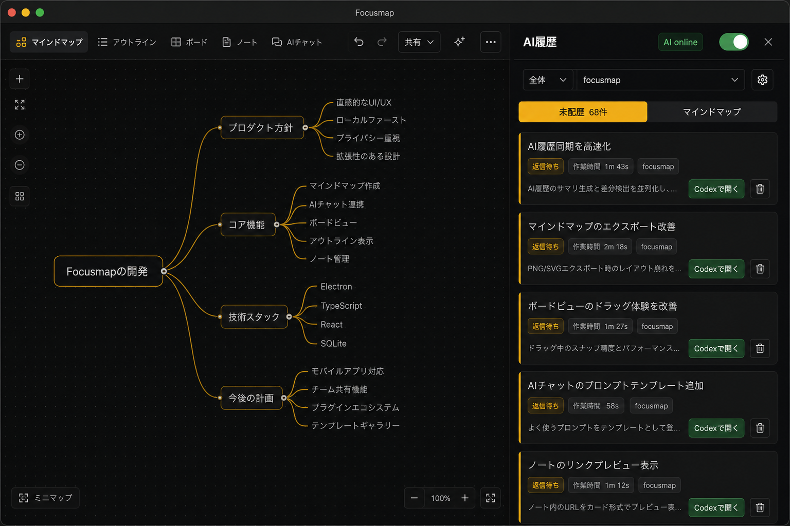

# AI History Sync Foundation Plan

Status: integrated on local main; push/deploy pending
Task ID: TASK-20260620-004
Date: 2026-06-20
Owner: task-router parent chat
Parallelization: HYBRID_PLAN_THEN_PARALLEL

## Goal

Focusmap の AI履歴を、Codex.app の全チャット履歴へ広げても壊れない基盤にする。

成功条件:

- サイドバーでは `未配置` と `マインドマップ` の2分類だけで見る。
- repo 選択は取り込み設定ではなく表示フィルタとして扱う。
- `全体` を選ぶと、選択中プロジェクトに紐づく複数 repo を横断して最新作業順に表示する。
- archived Codex thread は通常表示から完全非表示にし、Codex 側で archive 解除されたら復元する。
- 一覧は metadata のみ同期し、本文は詳細を開いた瞬間に取得する。
- 実行中 / 返信待ちはローカルで2秒以内、DB/UIは3秒以内を目標に反映する。
- Turso 無料枠に寄せるため、全文同期・毎秒DB書き込み・フルスキャンを避ける。

## Integration Result

Integrated commits:

- Contract: `6aa1c223`
- Backend/API: `3da457ba`
- Agent Sync: `a422b2f3`
- Frontend Sidebar: `649bb0f1`

Integration fixes:

- AI履歴サイドバーの既定pollを10秒から3秒へ戻し、document非表示時は送らない形でDB/UI 3秒反映目標に合わせた。
- `/api/ai-history` は `indexed_at|id` cursorを維持し、サイドバー側で取得済みitemを `running` 優先・`lastActivityAt` 新しい順へ表示sortするよう補正した。
- focusmap-agentのrunning metadata送信で、60秒以内は `lastActivityAt` とdurationだけの時計進行差分を再送しないようにした。状態・archive・title・repo/source/linkなど意味のある差分は引き続き即時送信する。
- docs/CONTEXT.mdに、現在のdetail activity実装は `linked_ai_task_id` ありを既存activityへbridgeし、未リンクは `202 hydrate_required` を返す段階であることを記録した。

Verification:

- npm test/lint/build/browser/curl/git diff --check は、ユーザー明示がないため未実行。
- Integrationでは `git show` / `git diff` / 実装差分読解によるcontract reviewのみ実施。

## Current Mockup

The accepted UI direction is the compact header version without a right-side toggle.



Mockup notes:

- The generated mockup still contains a right-side toggle; implementation must remove it.
- Keep the current dark Focusmap style, amber pending cards, green `Codexで開く`, compact card density, and Japanese list labels.
- Remove the large repo monitoring block, sync text, import buttons, Finder button, Codex board button, and search field from the sidebar.
- Header target:

```text
AI履歴   AI online   [全体 / focusmap ▼]   [設定アイコン]   [×]
未配置 68件 | マインドマップ
```

`AI online` means the feature is enabled in settings and the local agent is connected/running. It is not a user toggle in this sidebar.

## Product Decisions

### Sidebar Buckets

Use only two visible buckets:

```text
source_task_id is null     -> 未配置
source_task_id is not null -> マインドマップ
archived = true            -> hidden from normal UI
```

`マインドマップ` is a secondary view. The default sidebar view is `未配置`.

### Repo Selector

The repo selector is a display filter only.

- `全体`: all repos associated with the selected project.
- `focusmap` or another repo: only history from that repo.
- It must not change the sync scope by itself.
- Sync scope changes live in Settings.

### Settings

The sidebar gear opens the detailed settings screen for AI history / Codex sync.

Settings own:

- repo sync enable/disable
- project-to-repo associations
- local agent diagnostics
- future providers such as Claude Code
- advanced sync/reconcile settings

### Archive

Do not physically delete archived history rows.

- `archived=true`: hide completely from normal UI.
- `archived=false` on later reconcile: restore the same item.
- Preserve previous placement if `source_task_id` still exists.

### Details

Do not sync full chat body for all rows in normal list sync.

- List sync: title, repo, status, last activity, duration, archive state, placement.
- Detail open: fetch or hydrate latest message detail on demand.
- Future body search comes after metadata sync is stable.

## Data Contract

Final decision:

- Add `ai_history_items`.
- Add `project_repo_scopes`.
- Do not model the all-Codex history list by extending existing `ai_tasks`.
- Keep existing `ai_tasks` / Turso `ai_tasks` as execution tracking, compatibility summary, and activity bridge.
- Do not add a new full chat body table in this phase. Detail activity should reuse existing `ai_task_activity_messages` / Turso `ai_task_progress` via `linked_ai_task_id` where possible.

`ai_history_items`:

```text
ai_history_items
- id
- user_id
- provider                 codex_app, future claude_code, etc.
- external_thread_id        Codex thread id
- repo_path                 canonical repo root path
- worktree_path nullable    actual Codex cwd when different from repo root
- project_id nullable       first/representative display context
- source_task_id nullable   null = 未配置, set = マインドマップ
- linked_ai_task_id nullable existing ai_tasks bridge for activity/compat
- title
- snippet nullable          short preview only, capped
- status                    running | awaiting_approval | needs_input | completed | failed | idle
- run_state nullable        provider/raw run state
- last_activity_at          Codex activity timestamp
- indexed_at                server write/cursor timestamp
- started_at nullable
- ended_at nullable
- work_duration_seconds
- archived
- archived_at nullable
- deleted_at nullable       tombstone only if needed
- detail_synced_at nullable
- detail_message_count nullable
- metadata_json nullable
- created_at
- updated_at
```

`project_repo_scopes`:

```text
project_repo_scopes
- id
- user_id
- project_id
- provider
- repo_path
- display_name nullable
- sync_enabled
- last_scanned_at nullable
- last_reconciled_at nullable
- settings_json nullable
- created_at
- updated_at
```

Uniqueness:

```text
unique(user_id, provider, external_thread_id, repo_path)
unique(user_id, project_id, provider, repo_path)
```

Important indexes:

```text
(user_id, repo_path, indexed_at, id)
(user_id, repo_path, last_activity_at)
(user_id, source_task_id, last_activity_at)
(user_id, project_id, last_activity_at)
(user_id, provider, external_thread_id, repo_path)
(user_id, sync_enabled, updated_at) on project_repo_scopes
```

Do not use `last_activity_at` as the sync cursor. Use `indexed_at` so old Codex activity timestamps do not make new writes invisible to cursor-based clients.

Existing table boundaries:

- `ai_tasks`: command/execution tracking, manual handoff compatibility, `linked_ai_task_id` activity bridge.
- Turso `ai_tasks`: live task snapshot/event/activity bridge for existing task-progress UI.
- `tasks`: Focusmap mindmap node. AI history placement stores the target task id in `ai_history_items.source_task_id`; metadata-only sync must not auto-create a `tasks` node.
- `project_repo_scopes`: multi-repo display/sync scope. Existing `projects.repo_path` and `projects.codex_thread_import_enabled` are migration/default sources only.

## API Contract

### GET /api/ai-history

Query:

```text
project_id
repo=all | <repo_path>
placement=unplaced | mindmap | all
status=running | awaiting_approval | needs_input | completed | failed | idle | all
cursor optional
limit default 50 max 200
```

Response:

```ts
type AiHistoryListResponse = {
  items: AiHistoryListItem[];
  counts: {
    unplaced: number;
    mindmap: number;
  };
  nextCursor: string | null;
  sync: {
    featureEnabled: boolean;
    aiOnline: boolean;
    agentConnected: boolean;
    selectedRepo: "all" | string;
    repoOptions: Array<{
      repoPath: string;
      label: string;
      enabled: boolean;
      agentSeen: boolean;
    }>;
    lastIndexedAt: string | null;
    lastReconciledAt: string | null;
    nextReconcileAt: string | null;
  };
  page: {
    limit: number;
    cursor: string | null;
  };
};

type AiHistoryListItem = {
  id: string;
  provider: "codex_app" | string;
  externalThreadId: string;
  title: string;
  snippet: string | null;
  repoPath: string;
  repoLabel: string;
  worktreePath: string | null;
  placement: "unplaced" | "mindmap";
  sourceTaskId: string | null;
  linkedAiTaskId: string | null;
  status: "running" | "awaiting_approval" | "needs_input" | "completed" | "failed" | "idle";
  runState: string | null;
  lastActivityAt: string;
  startedAt: string | null;
  endedAt: string | null;
  workDurationSeconds: number | null;
  archived: boolean;
  detailHydrated: boolean;
  detailSyncedAt: string | null;
  codexOpenUrl: string | null;
};
```

Notes:

- Normal list response excludes `archived=true` and `deleted_at is not null`.
- No item includes full body, full transcript, raw rollout, command output, or unbounded JSON.
- `counts` respect the selected `project_id` and `repo` filter, but ignore the active `placement` tab so the header can show both bucket counts.

### GET /api/ai-history/snapshot

Purpose: UI and local sync diff.

Query:

```text
cursor=<indexed_at|id cursor>
project_id
repo=all | <repo_path>
include_deleted=true
limit=500
```

Rules:

- Use `indexed_at|id` cursor.
- `include_deleted=true` is for reconcile/restore diff only. Normal UI does not show deleted or archived rows.

### POST /api/agents/ai-history/batch-upsert

Purpose: focusmap-agent sends metadata changes only.

Rules:

- Batch by repo and provider.
- Upsert by `user_id + provider + external_thread_id + repo_path`.
- Accept archive state changes.
- Store `indexed_at` server-side.
- Do not require body/full message content.
- Accept `linked_ai_task_id` and `source_task_id` when the thread is already tied to an existing Focusmap task.
- Reject or sanitize raw rollout/full transcript fields if an old agent sends them.

### GET /api/ai-history/[id]

Purpose: list item detail shell.

Returns metadata, placement, linked ids, and whether details are hydrated.

### GET /api/ai-history/[id]/activity

Purpose: fetch/hydrate message detail only when the detail panel opens.

Reuse existing AI task activity endpoints where possible.

- If `linked_ai_task_id` exists, return the same display-safe activity as `/api/ai-tasks/[id]/activity`.
- If no linked task exists in the integrated Phase 1 code, return `202 hydrate_required` with provider/thread/repo metadata. Requesting local agent detail hydration and creating the smallest compatible `ai_tasks` stub remains a follow-up.
- Do not add a second full chat storage path in Phase 1.
- Return only display-safe user/assistant visible activity. Filter status/system/heartbeat/raw tool logs the same way existing activity API does.

## Agent Contract

The local agent owns Codex local truth.

Inputs:

- `~/.codex/sqlite/state_*.sqlite` threads metadata.
- thread rollout JSONL path from Codex thread rows.
- existing Focusmap import scopes / project repo scopes API.

Sync loops:

```text
app start / agent start       -> current project repo immediate reconcile
dashboard reload / scope diff -> current project repo immediate reconcile
hourly                        -> all enabled repos sequential reconcile
running threads               -> rollout watch around 1s
state transitions             -> immediate small POST, no heartbeat-style spam
```

Status detection:

- `task_started` -> running.
- `task_complete` -> awaiting_approval unless explicit completion/archive tells otherwise.
- `turn_aborted` -> awaiting_approval or failed/aborted depending existing semantics.
- new user message after awaiting -> running/resumed.
- `archived=1` -> `ai_history_items.archived=true` and hidden from normal UI.
- `archived=0` after archived -> restore same `ai_history_items` row and keep prior `source_task_id` if the task still exists.

Work duration:

- Sum `task_started -> task_complete / turn_aborted`.
- If currently running, add `latest_task_started -> now`.
- If rollout missing, fallback to coarse `created_at_ms / updated_at_ms` estimate and mark metadata as approximate.

Cost controls:

- Do not write every second.
- Write on state change, archive change, title change, repo association change, or meaningful last activity change.
- While a thread remains running, suppress clock-only `lastActivityAt` / duration metadata writes for 60 seconds when all other fields are unchanged.
- Batch metadata upserts.
- Do not upload full chat bodies during hourly scans.

Latency contract:

- Local state transition target: within 2 seconds.
- DB/UI reflection target: within 3 seconds.
- Running/awaiting/needs_input transitions must not wait for hourly reconcile.

## UI Acceptance

Desktop sidebar:

- Header is compact and single area.
- No right-side toggle.
- No search field in first implementation.
- No large repo monitoring panel.
- No `Sync` wording in sidebar.
- `AI online` appears only when the feature is enabled and the local agent is connected/running.
- If offline or disabled, show a muted `AI offline` or equivalent small status; settings explains why.
- Repo selector is display filtering only.
- Gear opens settings.
- Two equal-width tabs directly under header: `未配置 N件`, `マインドマップ`.
- Default tab: `未配置`.
- List starts higher than current design and shows more cards.
- Cards keep current Japanese look: amber rail/status for 返信待ち, green open button, work duration chip, repo chip, delete/archive action.
- Archived rows are absent.

Mobile:

- Do not introduce a separate semantic model.
- Same placement logic: `source_task_id null` = 未配置.
- If mobile UI is touched, keep it visually consistent but scope can be deferred to integration.

## Implementation Strategy

### Phase 1: Contract First

One Planner / Contract chat updates docs and creates exact API/data/UI acceptance.

No worker implementation should begin before Phase 1 is reviewed.

### Phase 2: Parallel Implementation After Contract

Allowed parallel work after contracts are fixed:

- Backend / DB worker
- Agent sync worker
- Frontend sidebar worker

Do not parallelize:

- DB migration across multiple workers
- shared TS types across multiple workers
- final integration

### Phase 3: Integration

Integration reviews all commits/reports and resolves contract drift before local main merge.

Push and deploy require a separate user approval.

## Worktree Plan

Base worktree:

```text
/Users/kitamuranaohiro/Private/focusmap-codex-reconcile-main
branch: main
status at contract update: main worktree, no pre-existing uncommitted changes, local main was ahead of origin/main by 1 commit
```

Suggested implementation branches if user chooses multi-chat work:

```text
codex/ai-history-contract
codex/ai-history-db-api
codex/ai-history-agent-sync
codex/ai-history-sidebar-ui
codex/ai-history-integration
```

Merge order:

1. `codex/ai-history-contract`
2. `codex/ai-history-db-api`
3. `codex/ai-history-agent-sync`
4. `codex/ai-history-sidebar-ui`
5. `codex/ai-history-integration`
6. user approval before local main merge if integration branch is separate
7. separate user approval before push/deploy

## Worker Prompts

### 1. Planner / Contract Chat

```md
あなたは Focusmap AI履歴同期基盤の Planner / Contract チャットです。

Repo:
/Users/kitamuranaohiro/Private/focusmap-codex-reconcile-main

まず読む:
- AGENTS.md
- docs/CONTEXT.md
- docs/ai/plans/active/20260620-ai-history-sync-foundation.md
- docs/specs/codex-app-handoff-monitoring/01-overview-and-flow.md
- docs/specs/codex-app-handoff-monitoring/03-backyard-sync-and-turso.md
- docs/specs/platform-boundaries.md

目的:
AI履歴を「未配置 / マインドマップ」の2分類、repo表示フィルタ、archive完全非表示+復元、metadata-only同期、detail on open、2秒以内状態反映に統一するための正本契約を作る。

編集してよい範囲:
- docs/CONTEXT.md
- docs/specs/codex-app-handoff-monitoring/*.md
- docs/ai/plans/active/20260620-ai-history-sync-foundation.md
- docs/ai/task-board.md（必要な最小更新のみ）

編集禁止:
- src/**
- scripts/**
- db/**
- package-lock.json
- secrets / .env*

やること:
1. 既存の Codex monitoring / ai_tasks / tasks / Turso snapshot の契約を確認する。
2. `ai_history_items` と `project_repo_scopes` を追加するべきか、既存テーブル拡張で足りるかを最終判断する。
3. API response schema を確定する。
4. UI acceptance を確定する。右上トグルなし、検索なし、上ヘッダー集約を必ず含める。
5. Agent sync contract を確定する。起動時、reload時、1時間巡回、running 1s watch、state transition即時POSTを含める。
6. Backend / Agent / Frontend / Integration worker に渡す差分を明確にする。

検証:
ユーザーが明示していないため npm test/lint/build/browser は実行しない。git status / git diff で自分の差分だけ確認する。

完了条件:
- docs/CONTEXT.md に正仕様が入っている。
- 実装workerが勝手にschemaやUI意味を変えなくてよいだけの契約がある。
- 自分の変更だけcommitし、pushしない。

最後に返す:
- changed files
- commit hash
- Backend / Agent / Frontend / Integration への更新済み引き継ぎ
- 未解決リスク
```

### 2. Backend / DB API Chat

```md
あなたは Focusmap AI履歴同期基盤の Backend / DB API 実装チャットです。

Repo:
/Users/kitamuranaohiro/Private/focusmap-codex-reconcile-main

前提:
Planner / Contract チャットのcommitをbaseにしてください。まだContractが完了していない場合は停止して報告してください。

まず読む:
- AGENTS.md
- docs/CONTEXT.md
- docs/ai/plans/active/20260620-ai-history-sync-foundation.md
- Planner / Contract の最終報告

編集してよい範囲:
- db/turso/migrations/**
- src/app/api/ai-history/**
- src/app/api/agents/ai-history/**
- src/app/api/agents/codex-monitor/**（契約上必要な最小範囲）
- src/lib/turso/**
- src/types/**
- backend/API tests only if adding tests is necessary

編集禁止:
- src/components/**
- src/hooks/**（API型のためだけに必要なら親へ確認）
- scripts/focusmap-agent/**
- desktop/**
- mobile/**
- package-lock.json
- secrets / .env*
- docs/ai/task-board.md / task-runs / archive（Integrationが担当）

実装要件:
- Turso/libSQL migrationで `ai_history_items` と `project_repo_scopes` を追加する。
- 既存 `ai_tasks` / Turso `ai_tasks` は実行tracking・compat・activity bridgeのまま残し、AI履歴一覧の正本へ流用しない。
- metadata-only list API を作る。
- `repo=all | repo_path` と `placement=unplaced | mindmap | all` を実装する。
- batch upsert API は `user_id + provider + external_thread_id + repo_path` で冪等にする。
- `indexed_at` を server write cursor として保存する。
- archive は物理削除せず hidden/tombstone として扱う。
- archive解除で同じ `ai_history_items` rowを復元し、既存 `source_task_id` がまだ存在する場合は配置を保持する。
- detail body は一覧APIに載せない。
- `GET /api/ai-history/[id]/activity` は `linked_ai_task_id` がある場合は既存 activity API と同じ表示安全化ルールを使う。
- Turso無料枠を意識し、indexなしscanや全文LIKEを避ける。

検証:
AGENTSに従い、npm test/lint/build/curlはユーザーが明示した場合だけ実行。必要な確認コマンド候補は最終報告に書く。

完了条件:
- API contractと一致。
- migrationが後方互換。
- 自分のallowed filesだけcommit。
- pushしない。

最後に返す:
- changed files
- migration名
- implemented endpoints
- schema/index decisions
- test commands run or not run
- commit hash
- contract deviations
- integration notes
```

### 3. Agent Sync Chat

```md
あなたは Focusmap AI履歴同期基盤の local agent / Codex sync 実装チャットです。

Repo:
/Users/kitamuranaohiro/Private/focusmap-codex-reconcile-main

前提:
Planner / Contract と Backend / DB API の契約を読んでください。API未実装なら、型に合わせてclient側まで作り、未接続箇所をintegration noteに残してください。

まず読む:
- AGENTS.md
- docs/CONTEXT.md
- docs/ai/plans/active/20260620-ai-history-sync-foundation.md
- scripts/focusmap-agent/src/codex-thread-monitor.ts
- scripts/focusmap-agent/src/api-client.ts
- scripts/focusmap-agent/src/types.ts
- scripts/codex-rpc-bridge.ts

編集してよい範囲:
- scripts/focusmap-agent/**
- scripts/codex-rpc-bridge.ts（必要最小限）
- agent tests if needed

編集禁止:
- db/**
- src/components/**
- src/app/api/**（API contract変更は禁止。必要なら停止して報告）
- desktop/** unless packaged agent launch behavior must change and parent approves
- package-lock.json
- docs/ai/task-board.md / task-runs / archive

実装要件:
- Codex local SQLite threads metadataからAI履歴metadataを同期する。
- rolloutから running / awaiting_approval / archived / duration を判定する。
- 起動時とscope変更時に現在project repoを優先reconcileする。
- 1時間ごとにenabled repoを順番に巡回する。
- running threadは約1秒でrolloutを監視する。
- DB/APIへの送信は状態変化・archive変化・archive解除・title変化・repo association変化・last activity変化・duration変化などの差分だけにする。
- 毎秒DB書き込みや全文本文送信は禁止。
- monitorが落ちていた期間もrolloutから作業時間を逆算する。
- `project_repo_scopes` を正にし、既存 `projects.repo_path` / `codex_thread_import_enabled` は移行・後方互換入力として扱う。
- `linked_ai_task_id` / `source_task_id` が既存manual handoffや既存取り込みtaskから判定できる場合はmetadata upsertに含める。

検証:
AGENTSに従い、npm test/lint/buildはユーザーが明示した場合だけ実行。必要な確認コマンド候補は最終報告へ。

完了条件:
- 2秒以内のlocal state transition反映を阻む待ち行列を作らない。
- archive解除で復元できるmetadataを送る。
- 自分のallowed filesだけcommit。
- pushしない。

最後に返す:
- changed files
- implemented sync loops
- rollout event mapping
- batching/write throttling behavior
- test commands run or not run
- commit hash
- contract deviations
- integration notes
```

### 4. Frontend Sidebar UI Chat

```md
あなたは Focusmap AI履歴サイドバー UI 実装チャットです。

Repo:
/Users/kitamuranaohiro/Private/focusmap-codex-reconcile-main

前提:
Planner / Contract と Backend API のresponse schemaを読んでください。API未実装なら既存data sourceに対する最小UI整理だけに留め、mock/TODOの削除条件を報告してください。

まず読む:
- AGENTS.md
- docs/CONTEXT.md
- docs/ai/plans/active/20260620-ai-history-sync-foundation.md
- docs/ai/plans/active/20260620-ai-history-sync-foundation-assets/ai-history-sidebar-header-concept.png
- src/components/dashboard/codex-chat-import-sidebar.tsx
- src/components/dashboard/mind-map.tsx
- src/components/mobile/mobile-mind-map.tsx（触る必要がある場合のみ）
- src/hooks/useTaskProgressSnapshot.ts

編集してよい範囲:
- src/components/dashboard/codex-chat-import-sidebar.tsx
- src/hooks/ AI history/sidebar related hooks only
- src/lib/ AI history display helpers only
- targeted UI tests if necessary

編集禁止:
- db/**
- src/app/api/**
- scripts/focusmap-agent/**
- desktop/**
- package-lock.json
- docs/ai/task-board.md / task-runs / archive

UI要件:
- 今の黒基調・黄色カード・緑の `Codexで開く`・カード密度を維持。
- 右上トグルなし。
- 検索バーなし。
- 大きい `リポ監視` ブロックなし。
- sync文言なし。
- 上ヘッダーに `AI履歴`、`AI online`、repo表示フィルタ、設定アイコン、閉じるだけを置く。
- `AI online` は機能ON + local agent connected/running の表示専用。
- repo selector は表示フィルタであり、取り込み/同期設定を変更しない。
- `未配置 68件 | マインドマップ` の2列タブをヘッダー直下に置く。
- デフォルトは未配置。
- `マインドマップ` は補助表示。
- archived rowsは出さない。
- チャットカード一覧をできるだけ上から始め、表示件数を増やす。
- `/api/ai-history` の `items` と `counts` を正にし、API contractにないfieldや旧 `ai_tasks` result shapeを前提にしない。
- `repo=all` は選択中projectに紐づく有効repo scopeの横断表示。selector変更だけで同期ON/OFF APIを呼ばない。

検証:
AGENTSに従い、browser/Playwright/npm test/lint/buildはユーザーが明示した場合だけ実行。必要な確認コマンド候補は最終報告へ。

完了条件:
- API contractにないfieldを前提にしない。
- 現UIの見た目を大きく崩さない。
- 自分のallowed filesだけcommit。
- pushしない。

最後に返す:
- changed files
- implemented UI behavior
- API assumptions
- test/manual checks run or not run
- commit hash
- screenshots/mockup comparison notes
- integration notes
```

### 5. Integration Finalizer Chat

```md
あなたは Focusmap AI履歴同期基盤の Integration Finalizer です。

Repo:
/Users/kitamuranaohiro/Private/focusmap-codex-reconcile-main

入力として受け取るもの:
- Planner / Contract commit hash and report
- Backend / DB API commit hash and report
- Agent Sync commit hash and report
- Frontend UI commit hash and report

まず読む:
- AGENTS.md
- docs/CONTEXT.md
- docs/ai/plans/active/20260620-ai-history-sync-foundation.md
- 各workerの最終報告

やること:
1. 各commitがallowed files内か確認。
2. API contract / DB schema / agent payload / UI assumptionsが一致しているか確認。
3. `AI履歴 = 未配置 / マインドマップ` が全層で同じ意味か確認。
4. repo selectorが表示フィルタに留まっているか確認。
5. archive hidden + restore が壊れていないか確認。
6. `ai_history_items` と `project_repo_scopes` が契約どおり追加され、既存 `ai_tasks` に全履歴一覧の意味を押し込んでいないか確認。
7. `linked_ai_task_id` による既存activity bridgeとdetail-on-openが一覧metadata-only契約を壊していないか確認。
8. indexed_at cursor とTurso index方針が守られているか確認。
9. 2秒/3秒反映目標を阻むpoll/write queueがないか確認。
10. 必要な最小修正だけintegration側で行う。
11. docs/CONTEXT.md とこのplanを最終状態へ更新。
12. task-board / task-runs / archive を最後に更新。

検証:
AGENTSに従い、テスト/lint/build/browser確認はユーザーが明示した場合だけ実行。明示されていない場合はdiff reviewのみ行い、必要な確認コマンド候補を報告する。

完了条件:
- 全worker成果が1本にまとまっている。
- local mainへ入れる前にユーザーへ明示確認する。
- push/deployはしない。

最後に返す:
- integrated commits
- changed files
- contract deviations resolved
- verification run or skipped by policy
- remaining risks
- local main merge可否の判断材料
```

## Integration Acceptance Checklist

- [x] モックアップ方針どおり右上トグルがない。
- [x] `AI online` は状態表示であり、sidebar上のON/OFFではない。
- [x] `全体` repo display filterでproject内複数repoを横断表示できる。
- [x] repo selectorが sync scope を変更しない。
- [x] `未配置` と `マインドマップ` の2分類だけである。
- [x] `source_task_id` の有無とUI分類が一致する。
- [x] archived rows are hidden.
- [x] archive解除で同じhistory itemが復元される。
- [x] list API is metadata-only.
- [ ] detail open hydrates body/activity on demand. Linked items use existing activity bridge; unlinked items currently return `202 hydrate_required`.
- [x] running/awaiting state transition is sent without waiting for hourly reconcile.
- [x] DB writes are batched and state-change based, not per-second spam.
- [x] `indexed_at` based cursor prevents missing old last_activity writes.
- [x] Turso queries use indexed filters and avoid full body search.
- [x] docs/CONTEXT.md records the final data/UI/sync contract.

## Out Of Scope

- Full body search.
- Claude Code provider implementation.
- Cross-device remote control.
- Production deployment.
- Push to origin/main.
- Manual production DB operation.
