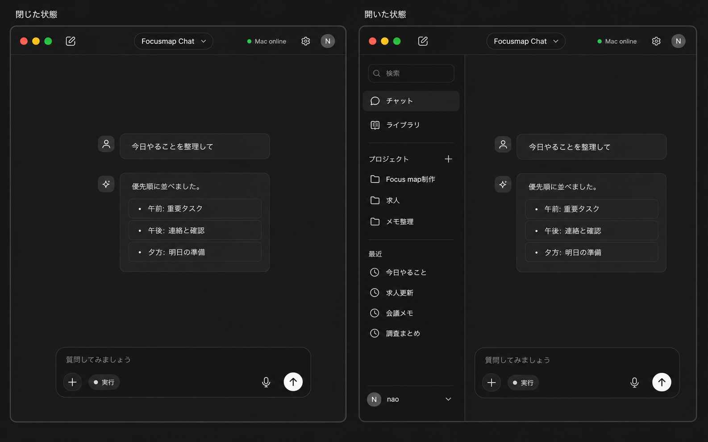

# チャット画面リデザイン モックアップ v2

作成日: 2026-06-12

## 方針

前回案の右レール、提案ボタン群、大きい空状態を削り、ChatGPT系UIに近い「細い会話カラム」「折りたたみ可能なサイドバー」「最小限の入力欄」を正面に置く。

## 2状態

| 状態 | 役割 |
| --- | --- |
| 閉じた状態 | チャット本文と入力に集中する通常状態。履歴や実行状況は出しすぎない。 |
| 開いた状態 | 会話・プロジェクト・最近の履歴を探す状態。メインの会話カラム幅は維持し、本文の読みやすさを変えない。 |

## 削ったもの

| 削った要素 | 理由 |
| --- | --- |
| 右の実行状況レール | チャット入力中の主目的から外れるため。必要なら上部や入力欄付近の小チップに圧縮する。 |
| 提案ボタンのグリッド | 最初の選択肢が多いと入力より選択が主役になるため。初期案はプレースホルダーと履歴で十分にする。 |
| 大きいロゴ・見出し | 起動直後に実行すべき操作は入力なので、ブランド表示より入力欄を優先する。 |
| 複数モードチップ | `相談` / `調査` / `添付` を並べると入力欄が設定UI化するため、常時表示は `実行` のみに絞る。その他は `+` に入れる。 |

## 残すボタン

| ボタン | 残す理由 |
| --- | --- |
| サイドバー切替 | 履歴を開く/閉じる主操作。閉じた状態を標準にできる。 |
| 新規チャット | 現在の文脈から離れる頻度が高く、サイドバー閉時にも必要。 |
| `+` | 添付、スクリーンショット、メモ挿入など低頻度入力をまとめる入口。 |
| `実行` | Focusmap固有の「Macで実行する」意図だけは送信前に見える必要がある。 |
| マイク | 手入力の代替。送信に近いが主操作ではない。 |
| 送信 | 唯一の強い主操作として右端に置く。 |

## 実装時の仕様メモ

- デスクトップの標準表示はサイドバー閉を優先し、履歴が必要な時だけ開く。
- 会話本文の最大幅はサイドバー開閉に関わらず約680〜760pxに保つ。
- `Mac online` は1画面1箇所だけにし、重複表示しない。
- `実行待ち` / `承認待ち` は常設レールではなく、小さいステータスチップ、または必要時だけ開くシートにする。
- モバイルではサイドバーを左シートにし、入力欄は `+ / 実行 / mic / send` の4操作に絞る。
