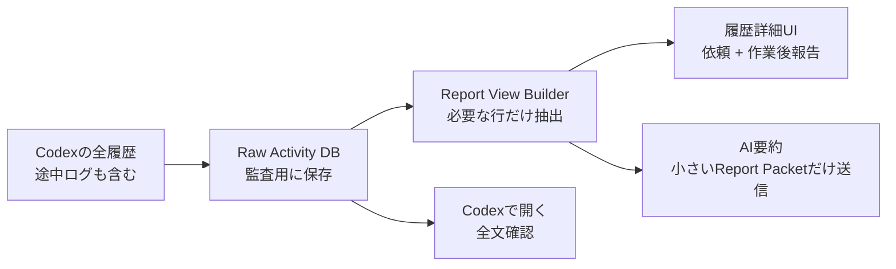

# Codex履歴 Report View モックアップ

作成日: 2026-06-17

## 目的

Codex / AIチャット履歴の詳細画面で、途中の細かい作業ログを本文に並べず、ユーザーが判断するための「依頼」と「作業後の報告」だけを中心に見せる。

対象モック:

- [report-only-codex-chat-history.html](./report-only-codex-chat-history.html)

## 画面方針

### 今の問題

今の履歴詳細では、次のような途中経過が本文に入りやすい。

- `3001は空いています。npm run dev:desktop を起動します`
- `開発サーバーの起動待ちです`
- `curlで確認します`
- `検証ログを修正してamendします`

これらは作業監査としては役に立つが、Focusmap上で次に判断する材料としては細かすぎる。

### 提案後

履歴詳細では、基本的にこの順で出す。

1. AI要約
2. 送信した依頼の折りたたみ
3. 作業後の報告
4. `Codexで開く` 導線

途中ログは本文には出さない。必要な場合だけCodex側の全文へ移動する。

## 素人向けのデータ送信の考え方

たとえるなら、Codexの作業履歴は「会議の録音全文」で、Focusmapに表示したいものは「議事録の結論」。

録音全文を毎回AIへ送ると、長すぎて、AIも人間も重要な点を見失いやすい。なので、Focusmap側で先に小さな「報告用メモ」を作る。

## データの流れ



## 何を残して、何を送らないか

### 表示・要約に使う

| 種類 | 使い方 |
|---|---|
| `sent` | 最初に送った依頼。長ければ折りたたみ |
| `user_answer` | 途中でユーザーが追加した判断や返答 |
| `completed` | 作業後の報告。最優先で表示 |
| `question` | Codexが判断を求めている時だけ表示 |
| `approval` | 確認待ちの説明として表示 |
| `failed` | 失敗理由と次の対応だけ表示 |

### 表示・要約に使わない

| 種類 | 理由 |
|---|---|
| `progress` | 作業中の細かい実況になりやすい |
| `status` | `running` など内部状態だけで判断材料が少ない |
| `system` | 監視や同期の内部ログ |
| raw `live_log` | 長すぎる。全文確認はCodexへ逃がす |
| appshot / environment / AGENTS全文 | 要約対象ではなく、文脈を圧迫する |

## AI要約へ送るReport Packet例

```json
{
  "title": "AIチャット履歴を整理",
  "status": "awaiting_approval",
  "request": "Chat 2へ渡す入力値だけ返して。worker用promptは作らないで。",
  "finalReport": "Chat 1完了。企画書: docs/ai/plans/active/settings-ui-redesign.md。推奨UI案: Direction A。まだ判断が必要な点: ...",
  "decisionNeeded": [
    "依頼文を常時表示するか、折りたたみにするか"
  ]
}
```

この形なら、制限のあるチャットでも全体像を把握しやすい。長い実行ログではなく、ユーザーの依頼と成果報告だけを渡すため。

## 実装する場合の分割

1. `Report View Builder` を共通関数として作る
   - 入力: `ai_task_activity_messages`
   - 出力: `request`, `finalReport`, `decisionNeeded`, `displayMessages`

2. PC右サイドバーに適用する
   - `src/components/dashboard/codex-chat-import-sidebar.tsx`
   - `selectedMessages` をそのまま出さず、Report Viewを表示する

3. スマホAIチャット履歴に適用する
   - `src/components/task-progress/task-progress-kanban.tsx`
   - `MobileImportChatDetail` も同じReport Viewを使う

4. AI要約入力に適用する
   - `src/lib/codex-display-summary.ts`
   - `detailText` と途中progressを要約入力から外す
   - `request + finalReport + status` だけでAI要約する

5. activity APIはrawを残す
   - `/api/ai-tasks/[id]/activity` は監査用データを返せるままにする
   - UI側で `view=report` を作るか、APIに `mode=report` を追加する

## 受け入れ条件

- 履歴本文に `起動待ち`、`curlで確認`、`amendします` のような途中ログが出ない
- AI要約へ `progress` / `status` / `system` が入らない
- 完了済みthreadでは `completed` または最後の作業後報告が主文になる
- 確認待ちthreadでは最後の質問や承認待ち文だけが主文になる
- raw activityは消さず、全文確認は `Codexで開く` から辿れる

## UIメモ

- 依頼文は白い吹き出しで常時表示すると画面を圧迫するため、初期状態は1行折りたたみがよい。
- 作業後報告は通常テキストとして広く見せる。カードで囲みすぎるとログっぽさが増える。
- AI要約には「送信量 約1.6KB」のような小さいメタ表示を付けると、ユーザーにも軽量化の意図が伝わる。
