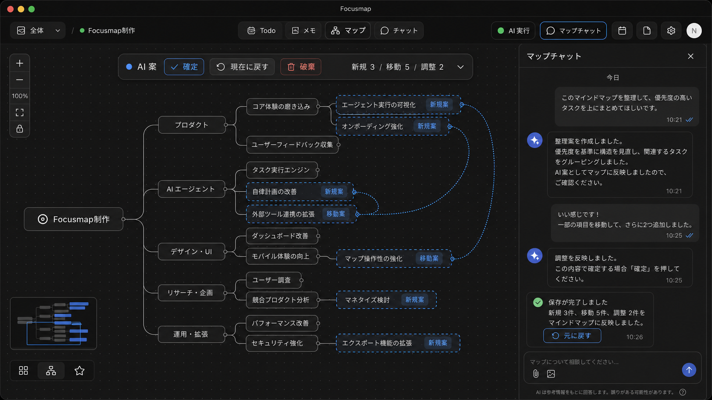

# マップチャットとAI案下書き

作成日: 2026-06-16
ステータス: 実装済み（local main / 未push）

## 目的

PCのマップ画面で、右サイドバーのプロジェクトチャットからマインドマップの整理案を出し、中央のマップ上で `AI案` として確認・手動調整・確定保存できるようにする。

## モックアップ

## 確定仕様

- 上部中央の旧 `AIで整理` ボタンは削除する。
- 右上の `AI実行` の右側に `マップチャット` ボタンを置く。
- `マップチャット` は右サイドバーで開き、カレンダー/メモ右ペインと排他にする。
- 右サイドバーの中身は選択中プロジェクトの `UnifiedChat` を使う。
- チャット経由のマップ変更は、原則として本番DBへ直接反映せず、プロジェクト全体の `AI案` 下書きとして保存する。
- `AI案` はチャットの整理案作成後に自動でマップへ表示する。
- `AI案` は最新案で上書きする。
- `現在に戻す` は `AI案` を非表示にするだけで、下書きは破棄しない。
- `破棄` は下書きを破棄扱いにする。
- `確定` は下書きを本番DBへ保存し、表示を `現在` マップへ戻す。

## 整理範囲

- デフォルトは現在マインドマップ上にあるノードだけを対象にする。
- 毎回「Codex未配置も含めるか」は聞かない。
- ユーザーが明示した時だけ、Codex取り込みチャット、未整理メモ、ノート見出しを対象に含める。
- AIが範囲拡張が必要だと判断した場合だけ、提案前に一度確認してよい。

## 保存対象

- 保存する: AI案の新規ノード。
- 保存する: AI案による既存ノード移動。
- 保存する: AI案上でユーザーが手動追加・移動・タイトル変更した内容。
- 保存する: 新規ノードの元メモ/チャット紐づき。
- 引き継ぐ: 既存ノードを移動する場合の既存メモ本文。
- 保存しない: AIによる既存ノードタイトルの一括変更。
- 保存しない: AIによる既存ノードのメモ/状態/進捗/予定変更。
- 削除しない: 削除候補は表示だけに留め、確定では削除しない。

## AI案UI

- 変更対象ノードは少し薄く表示する。
- 新規ノードは青い点線枠と `新規案` ラベルを付ける。
- 移動された既存ノードは青い点線コネクタまたは点線ハイライトと `移動案` ラベルを付ける。
- ユーザーがAI案上で調整したノードは `調整済み` と分かる表示にする。
- 状態バーには `AI案`、差分サマリー、`確定`、`現在に戻す`、`破棄` を置く。
- 差分サマリーは `新規 3 / 移動 5 / 調整 2` のように短く表示する。

## Undo / Redo

- `AI案` 確定時に、DB上の取り消し履歴を15日保持する。
- 履歴には反映前snapshot、反映後summary、追加ノード、移動/調整対象、元メモ/チャット紐づきを保存する。
- `元に戻す` は見た目だけでなく本番DB自体を反映前へ戻す。
- `元に戻す` はチャット完了カード、トースト、Cmd+Z / Ctrl+Z から実行できるようにする。
- Undo後はチャットに `元に戻しました。AI案の反映前のマインドマップに戻しました。` と短く出す。
- Undo後は `やり直す`、Cmd+Shift+Z、Ctrl+Shift+Z で同じAI案反映を再適用できるようにする。

## チャット表示

- 確定後は、チャットに短い完了文と差分サマリーを出す。
- 例: `保存が完了しました。新規3件、移動5件、調整2件を反映しました。`
- 完了メッセージには `元に戻す` ボタンを付ける。
- Undo後のメッセージは短くし、長い差分ログをチャット本文へ流さない。

## 実装分割案

1. UI入口
   - 旧 `AIで整理` ボタン削除。
   - `AI実行` の右側に `マップチャット` ボタン追加。
   - 右サイドバーのヘッダーを `マップチャット` に変更。

2. 下書きDB
   - `mindmap_drafts` と `mindmap_draft_nodes` 相当を追加する。
   - `project_id`、`chat_session_id`、`status`、`scope`、`summary`、`created_at`、`updated_at` を持たせる。
   - 最新active案は同一プロジェクト/チャットで上書きする。

3. AI案表示
   - 現在マップへ下書き差分を重ね、プロジェクト全体の下書きマップとして表示する。
   - `AI案` 状態バーと差分サマリーを追加する。
   - 下書き中のドラッグ/追加/タイトル編集は下書きDBへ保存する。

4. 確定API
   - 下書きを本番 `tasks` / 紐づきへ反映する。
   - 反映前snapshotをUndo履歴へ保存する。
   - 確定後にチャットへ完了メッセージと `元に戻す` actionを追加する。

5. Undo / Redo
   - `AI案` 確定履歴を15日保持する。
   - Undoは本番DBをsnapshotへ戻す。
   - Redoは同じ反映内容を再適用する。
   - 既存 `useUndoRedo` のCmd/Ctrl+Z導線にも接続する。

## 実装時に更新する場所

- `docs/CONTEXT.md`
- `src/components/layout/header.tsx`
- `src/app/dashboard/dashboard-client.tsx`
- `src/components/chat/unified-chat.tsx`
- `src/components/mindmap/custom-mind-map-view.tsx`
- `src/lib/ai/tools/index.ts`
- `src/app/api/ai/agent/route.ts`
- Supabase migration

## 実装メモ

- DBは `mindmap_drafts` / `mindmap_draft_nodes` / `mindmap_draft_history` を追加した。activeなAI案はプロジェクト単位で1件だけ持ち、履歴は `expires_at = now() + interval '15 days'` で保持する。
- APIは `/api/mindmap/drafts`、`/api/mindmap/drafts/[draftId]/nodes`、`/api/mindmap/drafts/[draftId]/apply`、`/api/mindmap/draft-history/[historyId]/undo|redo` を使う。
- AIツールは `saveMindmapDraft` を追加した。`proposeMindmapOrganization` は読み取り専用で、既定範囲は現在マップ上のノードのみ。Codex Inbox / 未整理メモ / ノート見出しはユーザー明示時だけ含める。
- UIは上部中央の旧 `AIで整理` を置かず、右上 `AI実行` の右側に `マップチャット` を置く。右サイドバーは選択中プロジェクトの `UnifiedChat` を表示する。
- マップは active draft をRealtimeと `focusmap:mindmap-draft:changed` で読み直し、`AI案` バー、`確定`、`現行`、`破棄` を表示する。AI案中の追加・移動・タイトル変更は下書きノードAPIへ保存する。
- 確定時は新規ノード、既存ノード移動、ユーザー手動タイトル変更、元メモ/チャット紐づきだけを本番 `tasks` / `memo_node_links` へ反映し、グローバルUndo/RedoへDB履歴ベースの `元に戻す` / `やり直す` を登録する。
