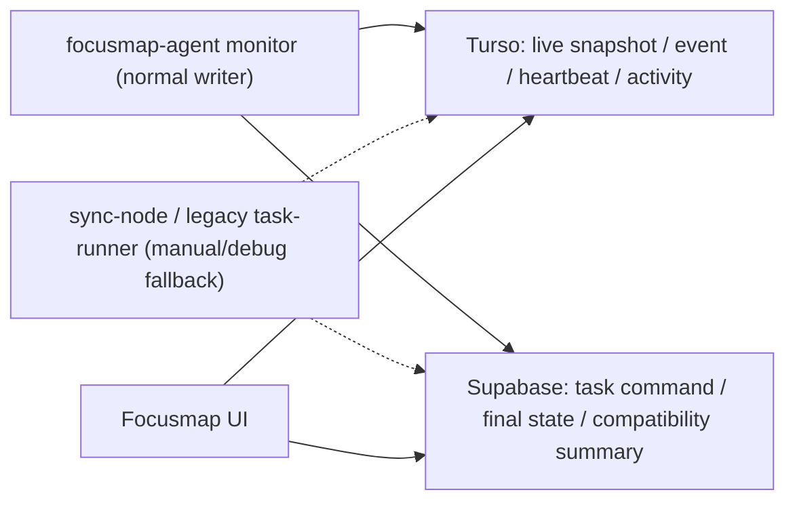

# 03. バックヤード同期とTurso節約

## ローカル監視とクラウド同期の違い

Macローカル監視とTurso同期は別物です。

Macローカル:

- agent起動中はCodex.app状態を1秒ごとに読んでよい。
- 人間の追加入力をすばやく検知してよい。
- sqlite / rollout / app-server をローカルで読む。
- 必要ならローカルにraw detailを持ってよい。

クラウド同期:

- 内容hashが変わった時、または最短間隔を過ぎた時だけ小さいsnapshotを送る。
- state event は意味のある状態変化だけ送る。
- 短いdetail tailは必要な時だけ送る。
- full log を毎tick送らない。

推奨間隔:

| 状況 | Mac local check | Cloud write/read |
|---|---:|---:|
| runner生存 | local process loop | 実行中5秒・アイドル30秒heartbeat upsert |
| running、詳細未表示 | Active Watch 1秒 | hash/活動時刻/状態変化時のみsnapshot |
| detail panel表示中 | Active Watch 1秒 + Detail Hydrate別loop | active watch + 3秒detail poll、本文同期はhydrate request中だけ |
| awaiting approval / needs input | 1秒可 | 追加入力・再開を1秒以内に反映 |
| runningなし | 通常background | 30から45秒、または手動更新 |
| 古いcompleted / failed | tight loop不要 | 低頻度、または手動 |

## 監視writerの本命一本化

通常のCodex監視writerはMac Supervisor配下の `focusmap-agent` 1本にする。`focusmap-agent` がCodex app-server通知、Codex state DB、rollout JSONLを読み、状態変化と軽量snapshotだけをTurso/Supabaseへ送る。Codex state DB は `FOCUSMAP_CODEX_STATE_DB_PATH` を最優先し、未指定時は `~/.codex/sqlite/state_5.sqlite` と `~/.codex/state_5.sqlite` の `threads.updated_at_ms` / `updated_at` 最大値を比較して最新DBを選ぶ。Macアプリ同梱API、`focusmap-agent`、互換 `scripts/task-runner.ts`、debug fallbackは同じresolverを使う。

- Focusmap Macアプリは、通常起動でNext 3001、`focusmap-agent`、Codex app-serverだけを自動確認する。Macアプリ内の接続/診断UIはElectron IPCでローカルSupervisorへ直接確認してよいが、通常ブラウザ・Webアプリ・スマホのonline/offline表示はTurso `runner_heartbeats` を正本にする。packaged appは同梱または現在の `AGENT_CLI` と同じpathで起動したagentだけを接続済み扱いにし、別worktreeや旧LaunchAgentのagentは `externalStale` として扱う。
- 旧 `scripts/task-runner.ts` は非Codex task、明示即時実行、既存互換のため残すが、Codex sqlite/rollout監視は通常無効にする。互換/デバッグで必要な時だけ `FOCUSMAP_LEGACY_CODEX_MONITOR=1` を付ける。
- Macアプリから旧 `task-runner` を自動kickするのは `FOCUSMAP_DESKTOP_ENABLE_LEGACY_TASK_RUNNER=1` を明示した時だけにする。
- `/api/codex/sync-node` は手動sync now、debug、移行中fallbackに限定し、通常の3秒UI更新や詳細表示だけを理由にsqlite/rollout探索とDB writeを起こさない。
- `ai_tasks.codex_thread_id` が保存済みのtaskは、`focusmap-agent` がそのthread IDだけを固定監視する。さらに、作成から24時間以内で `codex_manual_handoff=true` / `codex_run_state='prompt_waiting'` の未紐付けtaskは、agent専用APIが一時的に返し、Mac agentがCodex state DB の `first_user_message` をhandoff tokenまたは同期IDを除いたprompt先頭で照合して初回 `codex_thread_id` を保存する。manual handoffの既存task照合では `source_task_id`、`source_note_id`、`source_ideal_goal_id` のいずれかをFocusmap起点の証拠にする。旧 `~/.codex/state_5.sqlite` を直書きした古いFocusmap Macアプリbundleや常駐プロセスはstale扱いにし、現行resolverでDBを読めていることを確認する前に既知thread missingを削除扱いにしない。ローカルDBで一時的に見つからない時は `thread_unavailable` として `awaiting_approval` に留め、監視対象から永久除外しない。`running` の根拠は、最新の `task_started` の後に `task_complete` / `turn_aborted` がまだ無いことに限定する。`task_complete` / `turn_aborted` は `awaiting_approval`、Codex thread archiveはsource nodeをチェックして `completed` へ進める。thread一時未検出は完了根拠にしない。ユーザーがノードのチェックを外した場合は `codex_source_task_completion_suppressed=true` を保存し、閉鎖済みthreadの再同期でも自動再チェックせず `awaiting_approval` を維持する。確認待ち後の再開は `awaiting_approval_at` / `last_activity_at` より後の `user_message` または `task_started` だけを根拠にし、thread `updated_at_ms` 単体では `running` へ戻さない。
- `/api/agents/codex-monitor/tasks` は固定監視対象を返すagent専用APIで、`tasks.deleted_at is null` / `notes.deleted_at is null` / `ideal_goals.status != 'archived'` を満たすsourceだけを返す。source側が削除/アーカイブされたthreadは通常monitor対象から外し、以後は明示sync/debug fallbackでない限り追わない。
- `focusmap-agent` は既知の監視対象threadをActive Watchで1秒ごとにローカル確認するが、`/api/agents/codex-monitor/tasks`、import scope、AI履歴active target、detail watch requestの対象リスト取得はTarget Refreshとして既定2秒cacheにする。Recent Scanも既定2秒でmetadata中心に動かし、Detail HydrateとReconcile/BackfillはActive Watch tickから分離する。Codex state DB resolverのfreshness確認は30秒TTLでcacheし、rollout summaryはthread fingerprintでcacheして、sqlite/rollout parseを毎tickへ増やさない。
- Codex.appで直接開始された未配置threadを初回metadata同期する時も、`focusmap-agent` がrollout JSONLを先に読んで `task_complete` / `turn_aborted` / archive を確認し、`/api/agents/ai-history/batch-upsert` へ `status`、`run_state`、`archived`、durationを送る。既存 `/api/agents/codex-monitor/import-thread` は移行元/互換fallbackとしてだけ使い、新しいmetadata同期では未配置threadのために `tasks` ノードや `Codex Inbox` を自動作成しない。これにより、過去履歴のreconcile/backfillで完了済みthreadが緑の実行中カードとして表示される状態を防ぐ。
- runner heartbeatはTurso `runner_heartbeats` へ実行中5秒・アイドル30秒で1 row upsertする。作業中/待機中の切替時は即時upsertし、正常終了時は可能なら `status='offline'` を1回送る。クラッシュ、強制終了、スリープ時はoffline送信できないため、Web/スマホは `last_seen_at` が90秒以上古い場合もofflineと解釈する。
- Codexチャット取り込みのrepo選択は、通常UIではCodex Desktop state DBの `threads.cwd` から得たCodexプロジェクト候補だけを新規選択対象にする。候補はGit repo/worktreeならGit rootへまとめ、`~/Private` のようにGit repoではない実在cwdならそのフォルダ自体を候補に残す。保存済み `projects.repo_path` が候補外の場合は自動削除せず、`Codex候補外` として解除だけ可能にする。Finderは任意フォルダー選択ではなく、選択中repoを開く操作に限定する。
- runner heartbeat metadataにはCodex取り込み診断を載せる。`codex_thread_import` に `state_db_found`、`last_scope_refresh_at`、`last_scope_refresh_error`、`scopes[{ project_id, repo_path, enabled_since, cwd_paths }]`、`last_reconcile_at`、`next_reconcile_at`、`last_reconcile_imported`、`last_error`、tick duration / skipped tick / overrun / phase timings / active watch count / recent scan count / reconcile queue length を入れ、互換用に `codex_import_scope_repo_paths`、`codex_import_scope_cwd_paths`、`codex_last_scope_refresh_at`、`codex_last_reconcile_at`、`codex_last_tick_duration_ms`、`codex_skipped_ticks`、`codex_tick_overrun_ms`、`codex_phase_timings_ms`、`codex_active_watch_count`、`codex_recent_scan_count`、`codex_reconcile_queue_length` も残す。UIはMac onlineだけで監視成功とみなさず、選択repoがheartbeat metadataのscopeへ入っている時だけ `agent反映済み` と表示する。
- チャット取り込み一覧のrepo照合は `tasks.codex_work_dir` 完全一致だけにしない。`ai_tasks.result.meta.scope_repo_path` と対象projectの `repo_path` も選択repoと照合し、親repoを選んだ時はそのrepoのworktree pathで開始されたCodex threadも同じ履歴一覧へ表示する。実際のworktree pathは `codex_work_dir` に残し、親repo分類はscope/project側で判断する。
- このwriter所有者、監視間隔、クラウド保存条件、UIの更新表示を変える時は、同じ変更内で `docs/CONTEXT.md` とこの仕様書を更新する。

## AI履歴metadata同期

Codex.app全履歴を扱うAI履歴一覧は、既存 `ai_tasks` を拡張して作らない。`ai_tasks` はFocusmapから起動した実行task、manual handoff互換、既存activity表示のために残し、AI履歴一覧の正本はTurso/libSQLの `ai_history_items` と `project_repo_scopes` に分離する。

`ai_history_items`:

- `id`
- `user_id`
- `provider` (`codex_app`、将来 `claude_code` など)
- `external_thread_id`
- `repo_path`
- `worktree_path` nullable
- `project_id` nullable（初回/代表project）
- `source_task_id` nullable（null = `未配置`, non-null = `マインドマップ`）
- `linked_ai_task_id` nullable（既存activity/互換 `ai_tasks` への参照）
- `title`
- `snippet` nullable（一覧用短文のみ。本文ではない）
- `status` (`running` | `awaiting_approval` | `needs_input` | `completed` | `failed` | `idle`)
- `run_state` nullable（provider固有のraw state）
- `last_activity_at`
- `indexed_at`（server write/cursor timestamp）
- `started_at` nullable
- `ended_at` nullable
- `work_duration_seconds`
- `archived`
- `archived_at` nullable
- `deleted_at` nullable（明示削除/tombstone用。通常archiveには使わない）
- `detail_synced_at` nullable
- `detail_message_count` nullable
- `metadata_json` nullable
- `created_at`
- `updated_at`

`project_repo_scopes`:

- `id`
- `user_id`
- `project_id`
- `provider`
- `repo_path`
- `display_name` nullable
- `sync_enabled`
- `last_scanned_at` nullable
- `last_reconciled_at` nullable
- `settings_json` nullable
- `created_at`
- `updated_at`

`ai_history_detail_messages`:

- `id`
- `user_id`
- `history_item_id`
- `provider`
- `external_thread_id`
- `repo_path`
- `sequence`
- `role` (`user` | `assistant` | `system`)
- `kind` (`user_prompt` | `assistant_answer` | `assistant_question` | `status` | `summary`)
- `body`（sanitize済み表示本文のみ、1件8,000文字以内）
- `body_hash`
- `occurred_at` nullable
- `metadata_json` nullable（raw/full系キーは拒否）
- `created_at`
- `updated_at`

`ai_history_detail_hydrate_requests`:

- `id`
- `user_id`
- `history_item_id`
- `provider`
- `external_thread_id`
- `repo_path`
- `reason` (`detail_cache_empty` | `detail_cache_unsynced` | `detail_cache_stale`)
- `requested_by` (`web` | `agent` | `system`)
- `requested_at`
- `expires_at`
- `fulfilled_at` nullable
- `created_at`
- `updated_at`

Uniqueness:

- `ai_history_items`: `(user_id, provider, external_thread_id, repo_path)`
- `project_repo_scopes`: `(user_id, project_id, provider, repo_path)`
- `ai_history_detail_messages`: `(user_id, history_item_id, sequence, body_hash)`
- `ai_history_detail_hydrate_requests`: `(user_id, history_item_id)`

Indexes:

- `ai_history_items(user_id, repo_path, indexed_at, id)`
- `ai_history_items(user_id, repo_path, last_activity_at)`
- `ai_history_items(user_id, source_task_id, last_activity_at)`
- `ai_history_items(user_id, project_id, last_activity_at)`
- `ai_history_items(user_id, provider, external_thread_id, repo_path)`
- `project_repo_scopes(user_id, project_id, provider, repo_path)`
- `project_repo_scopes(user_id, sync_enabled, updated_at)`
- `ai_history_detail_messages(user_id, history_item_id, sequence, id)`
- `ai_history_detail_messages(user_id, provider, external_thread_id, repo_path)`
- `ai_history_detail_hydrate_requests(user_id, fulfilled_at, expires_at, requested_at)`
- `ai_history_detail_hydrate_requests(user_id, provider, external_thread_id, repo_path)`

`last_activity_at` は一覧並び順には使うが、同期cursorには使わない。古いCodex threadが後からmetadata更新されると `last_activity_at` が過去になるため、API cursorは必ず `indexed_at|id` にする。

### AI履歴API contract

`GET /api/ai-history` はmetadata-only一覧を返す。

Query:

```text
project_id=<uuid>
repo=all | <repo_path>
placement=unplaced | mindmap | all
status=running | awaiting_approval | needs_input | completed | failed | idle | all
cursor=<indexed_at|id> optional
limit default 50 max 200
```

Response:

```ts
type AiHistoryPlacement = "unplaced" | "mindmap";
type AiHistoryStatus = "running" | "awaiting_approval" | "needs_input" | "completed" | "failed" | "idle";

type AiHistoryListItem = {
  id: string;
  provider: "codex_app" | string;
  externalThreadId: string;
  title: string;
  snippet: string | null;
  repoPath: string;
  repoLabel: string;
  worktreePath: string | null;
  placement: AiHistoryPlacement;
  sourceTaskId: string | null;
  linkedAiTaskId: string | null;
  status: AiHistoryStatus;
  runState: string | null;
  lastActivityAt: string;
  startedAt: string | null;
  endedAt: string | null;
  workDurationSeconds: number | null;
  archived: boolean;
  detailHydrated: boolean;
  detailSyncedAt: string | null;
  codexOpenUrl: string | null;
};

type AiHistoryListResponse = {
  items: AiHistoryListItem[];
  counts: {
    unplaced: number;
    mindmap: number;
  };
  nextCursor: string | null;
  sync: {
    featureEnabled: boolean;
    aiOnline: boolean;
    agentConnected: boolean;
    selectedRepo: "all" | string;
    repoOptions: Array<{
      repoPath: string;
      label: string;
      enabled: boolean;
      agentSeen: boolean;
    }>;
    lastIndexedAt: string | null;
    lastReconciledAt: string | null;
    nextReconcileAt: string | null;
  };
  page: {
    limit: number;
    cursor: string | null;
  };
};
```

`GET /api/ai-history/snapshot` はUI差分・agent確認用に `cursor=<indexed_at|id>`、`project_id`、`repo=all | <repo_path>`、`include_deleted=true`、`limit`（max 500）を受ける。通常UIは `archived=true` / `deleted_at is not null` を出さない。`include_deleted=true` はreconcile/復元確認用で、通常listには使わない。

`POST /api/agents/ai-history/batch-upsert` はagent専用metadata upsert。batchはprovider/repo単位にまとめ、`user_id + provider + external_thread_id + repo_path` で冪等にupsertする。`indexed_at` はサーバーが付与する。payloadはtitle、snippet、status、run_state、last_activity_at、duration、archive状態、worktree_path、linked source idsだけを受け、full body / full rollout / raw command output は受けない。responseはupsert成功itemごとに `items[{ index, historyItemId, id, provider, externalThreadId, repoPath, projectId, sourceTaskId, linkedAiTaskId }]` を返す。Agentはdetail activity POSTの `[id]` に `external_thread_id` を使わず、必ず `historyItemId` を使う。

`GET /api/ai-history/[id]` はdetail shellを返し、`detail.hydrateRequired`、`detail.hydrateReason`、`detail.detailSyncedAt`、`detail.messageCount`、`detail.activityUrl` を示す。`GET /api/ai-history/[id]/activity` は、`linked_ai_task_id` があれば既存 `/api/ai-tasks/[id]/activity` へ307 redirectする。`linked_ai_task_id` が無いhistory itemはTurso `ai_history_detail_messages` のsanitize済みdetail cacheを返す。cacheが空なら `202` と `hydrate.required=true`、cacheが古い場合は既存messagesを返したうえで `hydrate.required=true` にする。古さ判定は `detail_message_count <= 0`、`detail_synced_at` 欠落、または `detail_synced_at < last_activity_at`。`hydrate.required=true` または `watch=1` のGETは、detail openというユーザー操作をMac agentへ伝えるため `ai_history_detail_hydrate_requests` に120秒TTL requestをupsertする。既に未期限の同一requestがある間はSQLの `WHERE expires_at < now OR fulfilled_at IS NOT NULL` で更新しないため、Frontendの短周期detail pollが毎回writeにならない。Turso readはdetail cache取得時の既存readに加えて同一requestのupsert試行だけで、writeは初回/期限切れ/完了後の再要求に限定する。

`GET /api/agents/ai-history/detail-hydrate-requests?runner_id=<runner>&limit=50` または同pathへの `POST { runner_id, limit }` はagent専用のhydrate request polling endpoint。Codex対応runnerだけが呼べる。responseは `requests[{ historyItemId, provider, externalThreadId, repoPath, reason, requestedAt, expiresAt, detailSyncedAt, detailMessageCount, lastActivityAt }]` を返す。Agentは通常5秒以内にpollし、120秒TTLを取り逃がさない。Agentはこの `historyItemId` を使ってdetail activityをPOSTし、POST後に同endpointを再pollして同じ `historyItemId` がactive requestとして残っていないことを確認する。残る場合はBackend契約不足としてdetail hydrate処理を止めて報告する。

`POST /api/agents/ai-history/[id]/activity` はagent専用のdetail cache差分upsertで、`runner_id` と `messages[]` を受ける。各messageは `sequence`、`role`、`kind`、`body`、任意の `occurred_at` / `metadata` だけを持つ。APIは `full_body`、`full_messages`、`raw_rollout`、`rollout_json`、`command_output`、`screenshot_body`、`image_body`、`base64` などのraw/full系フィールドを400で拒否し、8,000文字超や raw JSON / AGENTS / environment context らしい本文も拒否する。linked history itemへのPOSTは既存 `/api/ai-tasks/[id]/activity` を正にするため拒否する。

### AI履歴agent sync contract

- agent起動時 / app start時: 現在projectの有効repoを即reconcileし、Codex state SQLiteの全cwdもhot metadata同期対象にする。
- dashboard reload / scope diff: 現在project repoを優先reconcileする。repo selector変更は表示フィルタだけで、同期scopeやproject repo設定を変更しない。
- hourly: 全enabled repoを順番にmetadata reconcileし、最後に全cwdの最近履歴も補完する。
- hot history: Codex state SQLiteの全cwd最新20件と、監視中の各project/repo/worktree scopeごとの最新20件を読み、enabled repoに一致するcwd/worktreeはproject scopeへ、scope外cwdは `project_id=null` のAI履歴へ保存する。Git repo/worktreeとして解決できるcwdはGit rootを `repo_path`、実cwd差分を `worktree_path` にし、Git repoではないcwdはcwdフォルダ自体を `repo_path` にする。running taskがある時もAI履歴上位threadのstat watchは維持する。
- detail hydrate/watch target: hydrate requestで返った `historyItemId` / `externalThreadId` はrequest TTL内のfast-watch対象にする。detailを開いた時はcacheが最新でも `watch=1` 付きactivity GETで短TTL requestを作り、古いthreadがtop 20外でも再開を検知できるようにする。
- running/awaiting/needs_input thread: rollout JSONLを約1秒watchする。
- fast-watch read rule: fast-watch対象はrollout fileの `mtime/size` を1秒ごとにstatし、mtime/sizeまたはCodex thread row fingerprintが変わった時だけrollout本文を読む。fingerprintが同じ時は次のstat予定だけ更新し、cached本文の再parseやcloud writeへ進まない。
- state transition: `running`、`awaiting_approval`、`needs_input`、`completed`、`failed`、archive、archive解除は次のhourlyを待たず即時small POSTする。
- latency target: local state transitionは2秒以内、DB/UI反映は3秒以内。
- write rule: 状態変化、archive変化、archive解除、title変化、repo association変化、meaningful `last_activity_at` 変化、duration bucket変化、detail hydrate完了時だけcloud writeする。同一hash・durationだけの変化、毎秒DB書き込み、heartbeat風の同一snapshot書き込み、hourly full body uploadは禁止。
- duration: rolloutの `task_started -> task_complete / turn_aborted` を合算し、running中は最新 `task_started -> now` を足す。rolloutが欠ける時だけ `metadata_json.duration_approximate=true` で粗いthread timestamp推定にfallbackする。

## Turso保存ルール

Tursoは軽量monitoring state用です。ログ保管庫ではありません。

対象テーブル:

- `ai_history_items`: Codex.app/将来providerの履歴metadata一覧
- `ai_history_detail_messages`: 未リンクAI履歴のsanitize済みdetail cache
- `ai_history_detail_hydrate_requests`: detail open時の短TTL hydrate request
- `project_repo_scopes`: projectごとのAI履歴repo scope
- `ai_tasks`: 最新表示snapshot
- `ai_task_progress`: 短いtail/history
- `ai_task_events`: 状態変化event
- `runner_heartbeats`: runner生存
- `task_progress_watches`: detail open中のboost hint
- `screenshots`: metadataのみ。原本ではない。

保存してよいもの:

- task id / user id / space id
- source type / source id
- status
- `codex_thread_id`
- 文字数上限つき `current_step`
- 文字数上限つき `summary`
- compact progress metadata
- event type と小さいpayload
- heartbeat metadata
- 未リンクAI履歴detail open用のsanitize済みユーザーprompt / assistant表示回答

通常保存してはいけないもの:

- full `live_log`
- full `output`
- raw command output
- full thread history
- full rollout JSON
- image body / base64
- screenshot original
- 上限なしの巨大JSON

Mac agent側で圧縮する前提でも、API側で必ず防御的にsanitizeします。

## SupabaseとTursoの保存境界

高頻度のCodex監視で、毎回Supabaseへ書かない。Supabaseはタスク本体と重要な状態の正、Tursoはライブ表示用の軽い状態の正にする。



| 内容 | Supabase | Turso |
|---|---|---|
| task作成、prompt、user/source紐づけ | 保存する | 必要ならstub |
| `codex_thread_id` 初回検出 | 保存する | 保存する |
| `pending/running/awaiting_approval/needs_input/completed/failed` の状態変化 | 保存する | 保存する |
| 完了/失敗/確認待ちの最終summary | 保存する | 保存する |
| auto実行で `running -> awaiting_approval` へ変わる瞬間のユーザー可視Codex発話 | 短いfallbackとして保存可 | activityとして保存する |
| AI履歴metadataでのCodex thread archive観測 | `ai_tasks` は単体では完了扱いにしない。既存linked taskがあれば互換summaryだけ更新可 | `ai_history_items.archived=true` で通常UIから隠し、`source_task_id` は復元用に保持する |
| Focusmap側pending archive requestに対するCodex archive完了 | `ai_tasks.completed_at` と `result.codex_review_reason='archived'` を保存し、対象source nodeをチェック済みにできる | `completed` snapshot/eventを保存する |
| Codex threadのローカルDB一時未検出 | `result.codex_review_reason='thread_unavailable'` を保存し、監視を継続する。元ノードは自動完了しない | `awaiting_approval` snapshot/eventを保存する |
| `codex_last_checked_at` だけの更新 | 保存しない | 保存しない |
| running中の同じpulse/current_step | 保存しない | dedupeつきactivityのみ |
| runner heartbeat | 保存しない | 保存する |
| 詳細open時の短いactivity | Turso未設定時だけfallback保存 | 保存する |
| raw log / full rollout / full thread history | 保存しない | 保存しない |

`/api/codex/sync-node` は移行中のfallbackだが、無変化pollではSupabaseへ書かない。thread未検出で「見に行っただけ」の時はresponseに `checked_at` を返すだけにし、`ai_tasks.result.codex_last_checked_at` は更新しない。AI履歴metadataでsqlite上の `archived=1` を見つけた場合は `ai_history_items.archived=true` として通常UIから隠すだけにし、これ単体では `ai_tasks.status='completed'` や元ノード完了にしない。Focusmap側のpending archive requestに対してCodex archive完了を確認した場合だけ、既存manual handoffの互換動作として `ai_tasks.status='completed'` / `completed_at` と元ノード完了を保存できる。既存thread idがsqliteから一時的に読めなくなった場合は `thread_unavailable` の確認待ちとして扱い、監視を継続し、元ノードを完了しない。通常のCodex実行完了や承認待ちは、ユーザー確認前に元ノードを完了しない。

マップ/チャット取り込みUIでSupabase task stateを短周期に再取得してよいのは、Turso snapshotが欠落補完の証拠を持つ時だけにする。具体的には、`/api/task-progress/snapshot` に最近のactiveな `source_type='mindmap'` / `source_id` があり、現在の `tasks` stateにそのsource taskが無い場合だけ、画面側が `refreshFromServer({ staleMs: 3000, silent: true })` を発火する。欠落sourceが無い時はTurso snapshot pollだけで表示を更新し、Supabase全件3秒pollや表示中だけの追加writeへ戻さない。

activityはTursoを主にする。`FOCUSMAP_TURSO_ACTIVITY_PRIMARY` は未設定なら有効扱いで、Turso保存に成功したactivityはSupabaseへmirrorしない。明示的にSupabaseにもactivityを書きたい検証時だけ `FOCUSMAP_TURSO_ACTIVITY_PRIMARY=0` を設定する。Turso未設定またはTurso保存失敗時は、既存互換のためSupabaseへfallbackする。

`dispatch_mode='auto'` のCodex.app実行では、Mac側 `focusmap-agent` が `turn/start` 後のapp-server通知からユーザー可視のassistant発話だけを短いactivity候補として保持する。実行中は一覧向けsnapshotに本文を載せず、Codex turnが終わって `ai_tasks.status` を `running` から `awaiting_approval` へ更新する1回だけ、直近最大8件・各2000文字以内の可視発話と「確認待ち」status activityを `/api/agents/tasks/[id]/state` へ同送する。これにより詳細画面を開いた瞬間はクラウド側のactivityを読むだけでよく、開いてからローカルCodexログを取りに行く遅延を避ける。raw log、command output、full rollout、full thread historyはこの単発同期にも含めない。

## Turso無料枠に収める規律

通常の個人利用では、Turso Freeに余裕を持って収めることを目標にします。

write budgetの考え方:

- runner heartbeatは実行中5秒・アイドル30秒なら許容。
- running snapshot 1秒は、hash dedupe前提なら許容。ただし毎tick内容変化するtaskが複数ある場合はwriteが上振れする。
- detail open中だけ3秒boostを許容。
- 毎tick progress insertは禁止。
- 毎tick event insertは禁止。
- raw log の繰り返し保存は禁止。

概算:

| ケース | 月間write概算 | 備考 |
|---|---:|---|
| 1 runner heartbeat 5秒で常時active | 0.518M | 重めの上限見積もり。通常はidle30秒が混ざる |
| 1 running task 1秒、常に変化、24h/day | 2.592M | 通常snapshotの重めケース |
| 5 running tasks 1秒、常に変化、24h/day | 12.96M | 無料枠超過リスク。実際の送信はhash/活動時刻/状態変化時だけに抑える |
| 5 tasks detail-open 3秒、常に変化、24h/day | 4.32M | 重いが他writeが小さければ10M未満 |
| 全taskが2秒ごとにprogress/event insert | 危険 | 禁止 |

read budgetの考え方:

- `(updated_at, id)` cursor と `limit` を使う。
- 短周期APIで `select('*')` しない。
- hot pathで `count` しない。
- full scanを避ける。
- Web/スマホのMac online確認は画面が前面表示中の時だけ30秒ごとに読み、アプリ未起動・WebView/ブラウザ非表示・`document.visibilityState !== 'visible'` の間は止める。表示復帰時だけ即再取得する。
- user path / space path のcursor indexを維持する。

必要なindex:

- `(user_id, updated_at, id)`
- space取得を使う場合は `(space_id, updated_at, id)`
- progressは `(task_id, created_at)`
- eventsは `(task_id, created_at)`
- heartbeatは `(user_id, last_seen_at)`
- watchesは `(user_id, expires_at)` と必要に応じて `(task_id, expires_at)`

`task_progress_watches` は掃除が必要です。TTLでactive判定するだけでは不十分です。期限切れから24時間以上経過したwatchは、open/listなどで軽く削除します。

## Backend acceptance

backend修正は、次を満たす場合だけ理想に近づいています。

- manual handoff時、Codex.appを開く前、または同時にtracking taskを作る。
- `dispatch_mode='manual'` を通常runnerが勝手に `turn/start` しない。
- `dispatch_mode='auto'` は明示的な別モードとして残す。
- 通常のCodex監視writerは `focusmap-agent` 1本で、旧 `task-runner.ts` のCodex監視は `FOCUSMAP_LEGACY_CODEX_MONITOR=1` 明示時だけ動く。
- `snapshot_only=true` の通常POSTは最新snapshotだけ更新し、履歴insertしない。
- event insert は意味のある状態変化だけ。
- progress history は短く、上限つき。
- watch open/ping/close でdetail boostを制御する。
- expired watch が無限に増えない。
- 複数ユーザー/spaceを想定するrunnerでは監視対象をuser/spaceで絞る。
- Turso dual-write失敗で既存Supabase互換導線を壊さない。ただしTurso専用endpointは例外。
