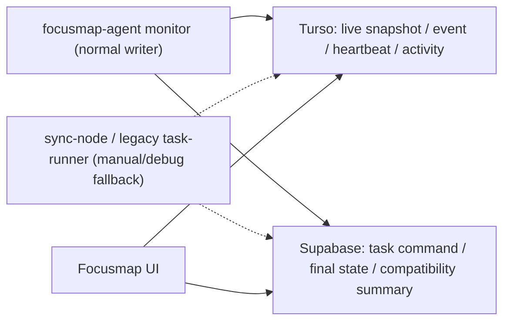

# 03. バックヤード同期とTurso節約

## ローカル監視とクラウド同期の違い

Macローカル監視とTurso同期は別物です。

Macローカル:

- agent起動中はCodex.app状態を1秒ごとに読んでよい。
- 人間の追加入力をすばやく検知してよい。
- sqlite / rollout / app-server をローカルで読む。
- 必要ならローカルにraw detailを持ってよい。

クラウド同期:

- 内容hashが変わった時、または最短間隔を過ぎた時だけ小さいsnapshotを送る。
- state event は意味のある状態変化だけ送る。
- 短いdetail tailは必要な時だけ送る。
- full log を毎tick送らない。

推奨間隔:

| 状況 | Mac local check | Cloud write/read |
|---|---:|---:|
| runner生存 | local process loop | 実行中3秒・アイドル30秒heartbeat upsert |
| running、詳細未表示 | 1秒 | 3秒最短snapshot、hash変化時のみ |
| detail panel表示中 | 1秒 | active watch + 3秒detail poll |
| awaiting approval / needs input | 1秒可 | 追加入力・再開を3秒以内に反映 |
| runningなし | 通常background | 30から45秒、または手動更新 |
| 古いcompleted / failed | tight loop不要 | 低頻度、または手動 |

## 監視writerの本命一本化

通常のCodex監視writerはMac Supervisor配下の `focusmap-agent` 1本にする。`focusmap-agent` がCodex app-server通知、`~/.codex/state_5.sqlite`、rollout JSONLを読み、状態変化と軽量snapshotだけをTurso/Supabaseへ送る。

- Focusmap Macアプリは、通常起動でNext 3001、`focusmap-agent`、Codex app-serverだけを自動確認する。
- 旧 `scripts/task-runner.ts` は非Codex task、明示即時実行、既存互換のため残すが、Codex sqlite/rollout監視は通常無効にする。互換/デバッグで必要な時だけ `FOCUSMAP_LEGACY_CODEX_MONITOR=1` を付ける。
- Macアプリから旧 `task-runner` を自動kickするのは `FOCUSMAP_DESKTOP_ENABLE_LEGACY_TASK_RUNNER=1` を明示した時だけにする。
- `/api/codex/sync-node` は手動sync now、debug、移行中fallbackに限定し、通常の3秒UI更新や詳細表示だけを理由にsqlite/rollout探索とDB writeを起こさない。
- このwriter所有者、監視間隔、クラウド保存条件、UIの更新表示を変える時は、同じ変更内で `docs/CONTEXT.md` とこの仕様書を更新する。

## Turso保存ルール

Tursoは軽量monitoring state用です。ログ保管庫ではありません。

対象テーブル:

- `ai_tasks`: 最新表示snapshot
- `ai_task_progress`: 短いtail/history
- `ai_task_events`: 状態変化event
- `runner_heartbeats`: runner生存
- `task_progress_watches`: detail open中のboost hint
- `screenshots`: metadataのみ。原本ではない。

保存してよいもの:

- task id / user id / space id
- source type / source id
- status
- `codex_thread_id`
- 文字数上限つき `current_step`
- 文字数上限つき `summary`
- compact progress metadata
- event type と小さいpayload
- heartbeat metadata

通常保存してはいけないもの:

- full `live_log`
- full `output`
- raw command output
- full thread history
- full rollout JSON
- image body / base64
- screenshot original
- 上限なしの巨大JSON

Mac agent側で圧縮する前提でも、API側で必ず防御的にsanitizeします。

## SupabaseとTursoの保存境界

高頻度のCodex監視で、毎回Supabaseへ書かない。Supabaseはタスク本体と重要な状態の正、Tursoはライブ表示用の軽い状態の正にする。

| 内容 | Supabase | Turso |
|---|---|---|
| task作成、prompt、user/source紐づけ | 保存する | 必要ならstub |
| `codex_thread_id` 初回検出 | 保存する | 保存する |
| `pending/running/awaiting_approval/needs_input/completed/failed` の状態変化 | 保存する | 保存する |
| 完了/失敗/確認待ちの最終summary | 保存する | 保存する |
| Codex threadのアーカイブ/削除による元ノード完了 | `ai_tasks.completed_at` と `tasks.status='done'` を保存する | `completed` snapshot/eventを保存する |
| `codex_last_checked_at` だけの更新 | 保存しない | 保存しない |
| running中の同じpulse/current_step | 保存しない | dedupeつきactivityのみ |
| runner heartbeat | 保存しない | 保存する |
| 詳細open時の短いactivity | Turso未設定時だけfallback保存 | 保存する |
| raw log / full rollout / full thread history | 保存しない | 保存しない |

`/api/codex/sync-node` は移行中のfallbackだが、無変化pollではSupabaseへ書かない。thread未検出で「見に行っただけ」の時はresponseに `checked_at` を返すだけにし、`ai_tasks.result.codex_last_checked_at` は更新しない。既存thread idがsqliteから読めなくなった `thread_deleted` と、sqlite上で `archived=1` になったthreadは、ユーザーがCodex側で片付けた合図として `ai_tasks.status='completed'` にし、`source_task_id` があれば元マインドマップノードも `done` にする。通常のCodex実行完了や承認待ちは、ユーザー確認前に元ノードを完了しない。

activityはTursoを主にする。`FOCUSMAP_TURSO_ACTIVITY_PRIMARY` は未設定なら有効扱いで、Turso保存に成功したactivityはSupabaseへmirrorしない。明示的にSupabaseにもactivityを書きたい検証時だけ `FOCUSMAP_TURSO_ACTIVITY_PRIMARY=0` を設定する。Turso未設定またはTurso保存失敗時は、既存互換のためSupabaseへfallbackする。

## Turso無料枠に収める規律

通常の個人利用では、Turso Freeに余裕を持って収めることを目標にします。

write budgetの考え方:

- runner heartbeatは実行中3秒・アイドル30秒なら許容。
- running snapshot 3秒は、hash dedupe前提なら許容。
- detail open中だけ3秒boostを許容。
- 毎tick progress insertは禁止。
- 毎tick event insertは禁止。
- raw log の繰り返し保存は禁止。

概算:

| ケース | 月間write概算 | 備考 |
|---|---:|---|
| 1 runner heartbeat 3秒で常時active | 864k | 重めの上限見積もり。通常はidle30秒が混ざる |
| 1 running task 3秒、常に変化、24h/day | 864k | 通常snapshotの重めケース |
| 5 running tasks 3秒、常に変化、24h/day | 4.32M | progress/eventを増やさなければ許容 |
| 5 tasks detail-open 3秒、常に変化、24h/day | 4.32M | 重いが他writeが小さければ10M未満 |
| 全taskが3秒ごとにprogress/event insert | 危険 | 禁止 |

read budgetの考え方:

- `(updated_at, id)` cursor と `limit` を使う。
- 短周期APIで `select('*')` しない。
- hot pathで `count` しない。
- full scanを避ける。
- user path / space path のcursor indexを維持する。

必要なindex:

- `(user_id, updated_at, id)`
- space取得を使う場合は `(space_id, updated_at, id)`
- progressは `(task_id, created_at)`
- eventsは `(task_id, created_at)`
- heartbeatは `(user_id, last_seen_at)`
- watchesは `(user_id, expires_at)` と必要に応じて `(task_id, expires_at)`

`task_progress_watches` は掃除が必要です。TTLでactive判定するだけでは不十分です。期限切れから24時間以上経過したwatchは、open/listなどで軽く削除します。

## Backend acceptance

backend修正は、次を満たす場合だけ理想に近づいています。

- manual handoff時、Codex.appを開く前、または同時にtracking taskを作る。
- `dispatch_mode='manual'` を通常runnerが勝手に `turn/start` しない。
- `dispatch_mode='auto'` は明示的な別モードとして残す。
- 通常のCodex監視writerは `focusmap-agent` 1本で、旧 `task-runner.ts` のCodex監視は `FOCUSMAP_LEGACY_CODEX_MONITOR=1` 明示時だけ動く。
- `snapshot_only=true` の通常POSTは最新snapshotだけ更新し、履歴insertしない。
- event insert は意味のある状態変化だけ。
- progress history は短く、上限つき。
- watch open/ping/close でdetail boostを制御する。
- expired watch が無限に増えない。
- 複数ユーザー/spaceを想定するrunnerでは監視対象をuser/spaceで絞る。
- Turso dual-write失敗で既存Supabase互換導線を壊さない。ただしTurso専用endpointは例外。
