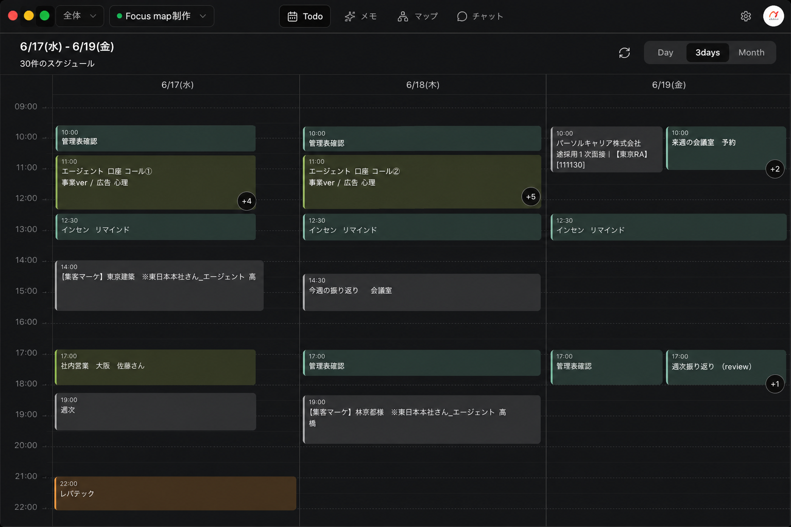

# Desktop Todo Calendar-Only View

Status: `proposed`
Last updated: 2026-06-17

## Context

PC / Mac desktop の `Todo` 画面は、現在は中央に `メモ + カレンダー` / `タイムライン` / `AI実行` のサブビュー、右側にカレンダーを持つ分割レイアウトになっている。

今回の提案では、PC版 `Todo` は一旦カレンダー表示に寄せる。左側のサブビュー領域をなくし、3日分のカレンダーを画面幅いっぱいに表示する。

Reference mockup:

## Requirements

1. PC / Mac desktop の `Todo` 初期表示はカレンダーのみを主画面にする。
2. `Todo` 初期表示のカレンダー範囲は `3days` にする。
3. 3日表示は、スマホ向けの圧縮表示ではなく、通常の1日タイムラインを3列に画面分割した見た目にする。
4. `メモ + カレンダー` / `タイムライン` / `AI実行` のサブビュー切替は、PC版 `Todo` 画面では表示しない。
5. 3日表示でも、各日の予定カードは可能な限り通常のDay表示と同じ密度で表示する。
6. `+N` overflow chip は、PC幅でも本当に重なりが多い時だけ使う。単に3daysだから潰して `+N` へ逃がす設計にはしない。
7. 上部のグローバルナビ、スペース切替、プロジェクト切替、`Todo` / `メモ` / `マップ` / `チャット` の主導線は維持する。
8. モバイルのToday / 3days表示は今回変更しない。スマホでは既存の `+N` 表示を維持する。
9. `マップ` / `long-term` などから開く任意のカレンダーサイドパネルは、狭い幅で使われるため今回の全幅3days初期表示とは分けて扱う。

## Non-Goals

- Google Calendar 同期方式、API、DB schema は変更しない。
- `メモ`、`AI実行タイムライン`、`TodayTaskBoard`、`TodayMemoBoard` コンポーネント自体は削除しない。
- モバイル下部ナビやスマホTodayの情報設計は変更しない。
- 予定作成・編集・削除を読み取り専用化するかは今回未決定。まずは「Todo画面の主表示をカレンダーだけにする」ことを対象にする。
- カレンダーのGoogle側反映問題やチャット経由の予定変更問題は別仕様で扱う。

## Acceptance Criteria

1. PC / Mac desktop で `Todo` を開くと、左側にメモボード、AI実行タイムライン、タイムライン切替が表示されない。
2. 同じ画面で、3日分の時間軸カレンダーがメイン領域いっぱいに表示される。
3. 初期状態で `3days` が選択済みになっている。
4. 3日表示のヘッダーは `M/d(E) - M/d(E)` の範囲とスケジュール件数を表示する。
5. 3列の各日カラムは均等幅で、時刻軸は左に1本だけ表示される。
6. 予定カードのタイトルはPC幅では読める幅を確保し、カード本文が不自然に1文字単位で折り返されない。
7. Day / Month への切替は残り、切替後もTodo画面内で全幅表示される。
8. モバイル幅では既存のToday画面が維持される。
9. `マップ` 画面や `long-term` 画面の任意カレンダーサイドパネルには、このTodo専用全幅レイアウトが混入しない。

## Implementation Notes

- `src/app/dashboard/dashboard-client.tsx`
  - desktop `activeView === 'today'` の中央サブビューを廃止し、カレンダーコンポーネントを主領域へ表示する。
  - `activeView === 'today'` では右サイドバーとしてのカレンダーを重複表示しない。
- `src/components/dashboard/desktop-today-panel.tsx`
  - `defaultRangeMode` のようなpropを追加し、Todo主領域では `3days`、狭い任意サイドパネルでは従来通り `day` を選べるようにする。
- `src/components/today/today-3days-calendar.tsx`
  - 既存の `48px repeat(3, minmax(0, 1fr))` 構造は全幅表示と相性がよい。必要ならPC幅だけカードの最大表示行数や重なり時の見せ方を微調整する。

## Image Backup

- Generated with the built-in `image_gen` path from the `imagegen` skill.
- Saved artifact: `docs/specs/desktop-todo-calendar-only/mockup-desktop-3days-calendar-only.png`

